

# Δημιουργία Οντολογίας με τη χρήση του λογισμικού Protégé

Χαροκόπειο Πανεπιστήμιο, Τμήμα Γεωγραφίας, ΠΜΣ “Εφαρμοσμένη Γεωγραφία και Διαχείριση του Χώρου”, Ερευνητικά θέματα στη Γεωπληροφορική 

Χριστόφορος Βραδής, υποψήφιος διδάκτορας Τμήματος Γεωγραφίας Χαροκοπείου Πανεπιστημίου.

Μάρτιος 2023

---

# Σχετικά με το λογισμικό Protégé

Το **Protégé Desktop**, ένα ελεύθερο λογισμικό/λογισμικό ανοικτού κώδικα (ΕΛ/ΛΑΚ), αποτελεί ίσως το πλέον διαδεδομένο και πλούσιο σε δυνατότητες περιβάλλον επεξεργασίας **οντολογιών** και παρέχει πλήρη υποστήριξη της γλώσσας [OWL 2](https://www.w3.org/TR/owl2-overview/). 

Οι δυνατότητές του περιλαμβάνουν την υποστήριξη **συλλογιστών** (reasoners), οι οποίοι βασίζονται σε **περιγραφικές λογικές** (description logic) όπως π.χ. το HermiT και το Pellet. 

Το Protégé Desktop παρέχει τη δυνατότητα δημιουργίας και επεξεργασίας μιας ή περισσότερων οντολογιών σε έναν ενιαίο γραφικό περιβάλλον εργασίας, μέσω μιας πλήρως παραμετροποιήσιμης διεπαφής χρήστη. 

Ορισμένα από τα εργαλεία οπτικοποίησης που παρέχει επιτρέπουν τη διαδραστική πλοήγηση στις **κλάσεις** αλλά και στις **σχέσεις** των κλάσεων και των οντολογιών. 

Η υποστήριξη **επεξηγήσεων** (explanations) βοηθά στον εντοπισμό λογικών ασυνεπειών που μπορεί να υπάρχουν στην οντολογία. 

Άλλες διαθέσιμες λειτουργίες που παρέχει αφορούν την **αναδιαμόρφωση μιας οντολογίας** (refactoring), τη **συγχώνευση οντολογιών** (ontology merging), τη μετακίνηση αξιωμάτων μεταξύ οντολογιών, την ταυτόχρονη μετονομασία πολλαπλών οντοτήτων και πολλές άλλες.

([Πηγή](https://protege.stanford.edu/products.php#web-protege)). 

---

# Σχετικά με το λογισμικό Protégé

Ορισμένα από τα χαρακτηριστικά του Protégé περιλαμβάνουν:

- Πλήρη συμβατότητα με πρότυπα του W3C που χρησιμοποιούνται στον Σημασιολογικό Ιστό (OWL, RDF κ.α.)

- Παραμετροποιήσιμη γραφική διεπαφή χρήστη

- Υποστήριξη οπτικοποίησης οντολογίας

- Υποστήριξη αναδιαμόρφωσης οντολογίας

- Άμεση διασύνδεση με συλλογιστές (reasoners), εξαγωγή συμπερασμών καθώς και λογικό έλεγχο οντολογιών

- Επέκταση λειτουργικότητας με τη χρήση πρόσθετων λογισμικών ([plugins](https://protegewiki.stanford.edu/wiki/Protege_Plugin_Library))

- Υποβολή ερωτημάτων με χρήση της γλώσσας [SPARQL](https://www.w3.org/TR/sparql11-overview/)

Αναλυτική βοήθεια σχετικά με τις διαθέσιμες δυνατότητες του Protégé μπορείτε να βρείτε στους παρακάτω ιστοτόπους:

- https://protege.stanford.edu/support.php#documentationSupport
- https://protegewiki.stanford.edu/wiki/ProtegeDesktopUserDocs
- https://protegewiki.stanford.edu/wiki/Pr4_UG_mi_Outline

---

# Εγκατάσταση του λογισμικού Protégé

Επισκεφθείτε τον ιστότοπο https://protege.stanford.edu/products.php#desktop-protege και κατεβάστε την πλέον τελευταία έκδοση ανάλογα το λειτουργικό σας σύστημα (Windows, macOS, Linux). 

Εναλλακτικά, μπορείτε να χρησιμοποιήσετε την **διαδικτυακή έκδοση** (Web Protege) στον ιστότοπο http://webprotege.stanford.edu/, αλλά θα πρέπει να έχετε υπόψη ότι η έκδοση αυτή δεν υποστηρίζει όλες τις δυνατότητες που υποστηρίζει η desktop έκδοση. 

Ας σημειωθεί ότι προς το παρόν δεν διατίθεται κάποια native έκδοση για κινητές/έξυπνες συσκευές με λειτουργικά συστήματα iOS ή/και Android.

---

# Η αρχική οθόνη του Protégé

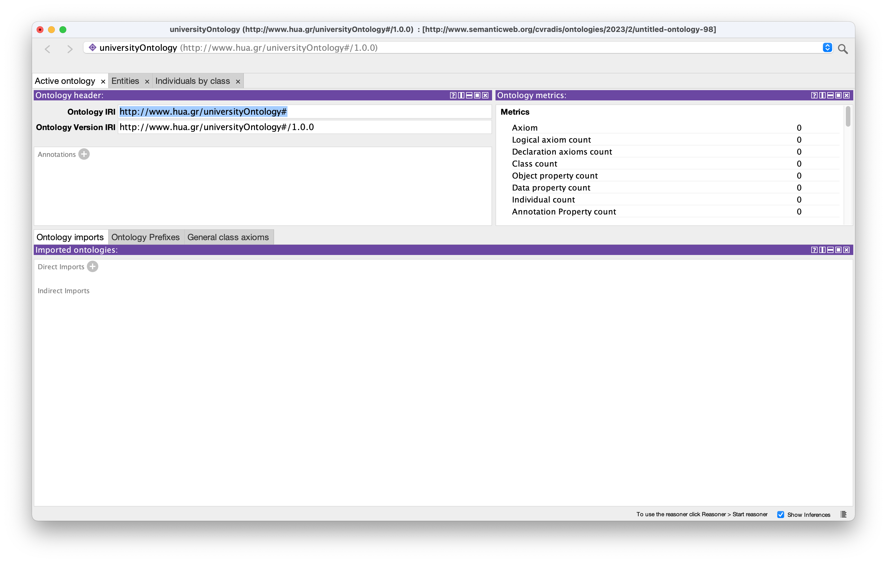

---

# Η αρχική καρτέλα

Οι δυνατότητες που παρέχει το Protégé είναι οργανωμένες σε **καρτέλες** (tabs). 

Η αρχική καρτέλα "Active ontology" παρέχει γενικές πληροφορίες σχετικά με την τρέχουσα οντολογία στην οποία εργαζόμαστε. Το πρώτο βήμα είναι ο καθορισμός του URI/IRI με το οποίο θα είναι μοναδικά αναγνωρίσιμη η οντολογία που δημιουργούμε. Για την συγκεκριμένη οντολογία επιλέχθηκε το URI **"http://www.hua.gr/universityOntology#"**. 

Υπόψη ότι ένα ΙRI (ή URI) μπορεί να μην αποτελεί ταυτόχρονα και URL. Εφόσον πρόκειται να δημοσιευθεί η υπό ανάπτυξη οντολογία στον Σημασιολογικό Ιστό, τότε θα πρέπει το IRI που θα χρησιμοποιηθεί να υπάρχει και ως URL (διαδικασία γνωστή ως [**dereferencing**](https://www.loc.gov/standards/uri/about.html)). Προαιρετικά, μπορεί να προστεθεί και ένα IRI το οποίο θα περιέχει την εκάστοτε έκδοση της οντολογίας.

---

# Ontology imports

Στην καρτέλα **"Ontology imports"** μπορούμε να δούμε αν υπάρχουν **εξωτερικές οντολογίες** οι οποίες έχουν εισαχθεί στην τρέχουσα οντολογία (Direct imports) με σκοπό την επαναχρησιμοποίησή τους (κάτι το οποίο είναι εξαιρετικά συνηθισμένο κατά την ανάπτυξη οντολογιών). 

Επίσης μπορούμε να δούμε ποιες οντολογίες έχουν "έμμεσα" εισαχθεί (Indirect imports). Πρόκειται για οντολογίες οι οποίες χρησιμοποιούνται χωρίς να τις έχουμε εισάγει άμεσα. Στο τρέχον σημείο της  ανάπτυξης της οντολογίας δεν έχει εισαχθεί (άμεσα ή έμμεσα) κάποια άλλη οντολογία. Π.χ. αν είχαμε εισάγει την οντολογία [GeoSPARQL](http://www.opengis.net/ont/geosparql) τότε η καρτέλα αυτή θα έμοιαζε με το παρακάτω στιγμιότυπο οθόνης:

---

## Υποθετική εισαγωγή της οντολογίας GeoSPARQL

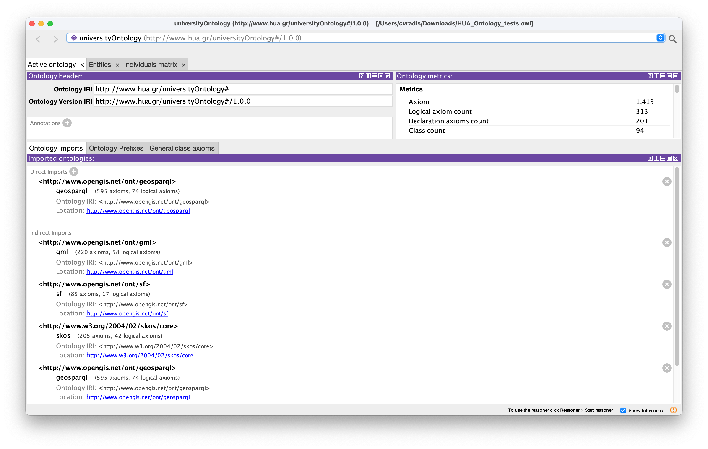

---

# Ontology prefixes (συντομογραφίες)

Στην καρτέλα **"Ontology prefixes"** μπορούμε να δούμε και να ορίσουμε τα prefixes που χρησιμοποιεί η οντολογία μας. 

Έχουν ήδη ορισθεί κάποια προθήματα (prefixes) που αντιστοιχούν σε κάποια ονόματα χώρου συγκεκριμένων οντολογιών και λεξιλογίων που χρησιμοποιούνται από την ίδια τη γλώσσα OWL (όπως το RDF, RDFS, XML και XSD). 

Επειδή σε κάθε οντότητα (class, property κλπ) στην OWL θα αντιστοιχήσουμε ένα (μοναδικό) IRI, χρειαζόμαστε έναν τρόπο σύντμησης της γραφής των IRI αυτών, οπότε συχνά ορίζουμε συντομογραφίες με τη μορφή `prefix:name`, όπου 

- prefix: είναι ένα όνομα προθέματος που αντιστοιχεί σε τμήμα εντός IRI και 
- name είναι το υπόλοιπο τμήμα που συνήθως αντιστοιχεί στο όνομα που αποδίδουμε στην κλάση, στην σχέση ή στην πραγμάτωση εντός της οντολογίας. 

---

# Ontology prefixes

Όπως προαναφέρθηκε, η OWL χρησιμοποιεί τα εξής προθήματα:

- rdf:	http://www.w3.org/1999/02/22-rdf-syntax-ns#
- rdfs:	http://www.w3.org/2000/01/rdf-schema#
- owl:	http://www.w3.org/2002/07/owl#
- xsd:	http://www.w3.org/2001/XMLSchema#

Επιπλέον των παραπάνω προθημάτων, στην παρούσα οντολογία έχουμε προσθέσει ακόμα ένα όνομα χώρου που αντιστοιχεί στα δεδομένα που διαθέτει το [Wikidata](http://www.wikidata.org/) και αυτό επειδή (σε επόμενο βήμα) θα εισάγουμε δύο "εγγραφές" από το Wikidata: 

- μία εγγραφή που αντιστοιχεί σε μία έννοια (**class**) και 
- μία για ένα αντικείμενο (**individual**) 

ώστε να δώσουμε ένα παράδειγμα διασύνδεσης της οντολογίας μας τόσο σε επίπεδο εννοιών (class) όσο και σε επίπεδο αντικειμένων (individual).

---
# Ontology prefixes

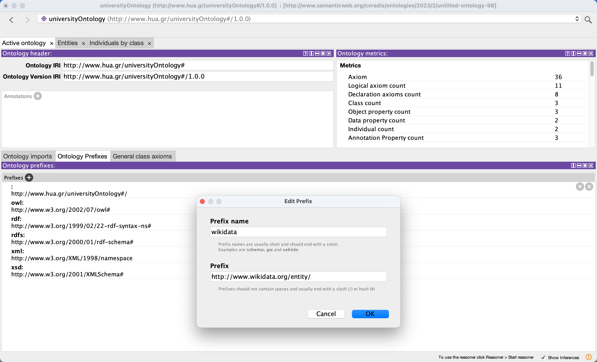

---

# Ontology prefixes

Ετσι, τα prefixes που θα χρησιμοποιούνται στην οντολογία μας θα είναι τα παρακάτω:

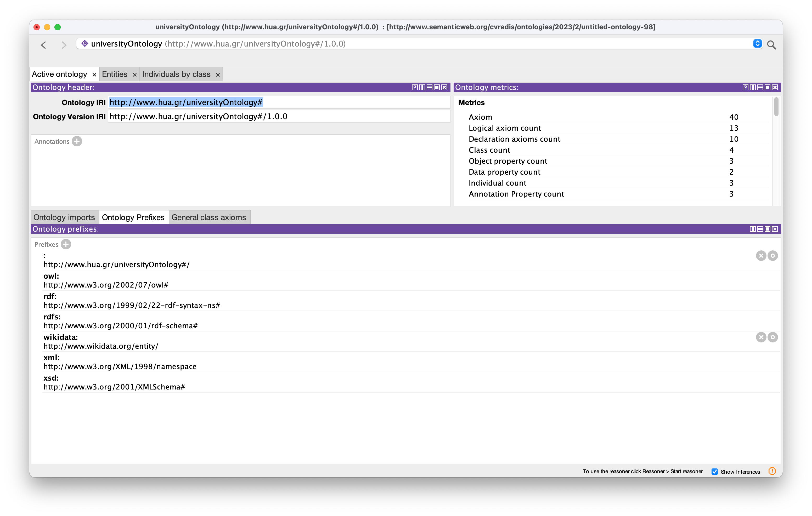

---

# Ontology prefixes

Στην παραπάνω λίστα, το πρώτο πρόθημα ":" είναι αυτό που χρησιμοποιείται από την οντολογία που αναπτύσσουμε, το οποίο αντιστοιχεί στο IRI <http://www.hua.gr/universityOntology#> και προστίθεται αυτόματα από το Protégé.

Στη συνέχεια ακολουθούν περιγραφές του τρόπου με τον οποίο μπορούμε να εισάγουμε classes, object properties, data properties και individuals στο Protégé.

---

# Προσθήκη κλάσεων (classes)

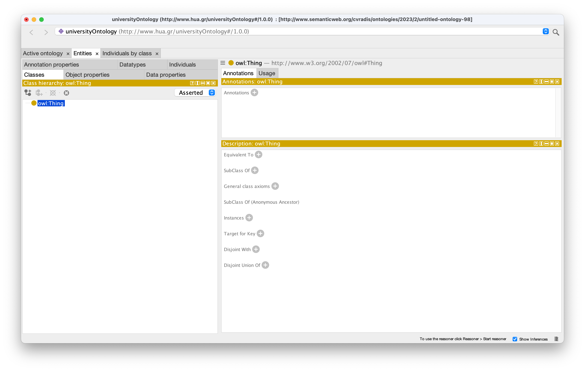

---

# Προσθήκη κλάσεων (classes)

Η θέαση και προσθήκη κλάσεων γίνεται από την κύρια καρτέλα **"Entities"** και την υπο-καρτέλα **"Classes"**. 

Η κλάση που θα εμφανίζεται πάντα είναι η **`owl:Thing`** η οποία αποτελεί ουσιαστικά ένα σύνολο που περιέχει όλα τα πιθανά individuals της οντολογίας μας και αν την θεωρήσουμε ως έννοια, τότε αυτή αποτελεί την πλέον γενική έννοια: κάθε άλλη κλάση που θα δημιουργήσουμε θα είναι υποχρεωτικά υποκλάση της `owl:Thing`.

---

# Προσθήκη κλάσεων (classes)

Θεωρώντας ότι έχει προηγηθεί μια (σύντομη σχετικά) **σημασιολογική ανάλυση** του ελεύθερου κειμένου από το οποίο θα δημιουργήσουμε την οντολογία, αναγνωρίζουμε τις παρακάτω **κλάσεις** (σε παρένθεση δίνεται μια σύντομη επεξήγηση τους στα ελληνικά):

- `University` (η κλάση που αντιστοιχεί στην έννοια "Πανεπιστήμιο" και αποτελεί το σύνολο το οποίο περιλαμβάνει όλα τα Πανεπιστήμια)
- `School` (η κλάση που αντιστοιχεί στην έννοια "Σχολή")
- `Department` (το "Τμήμα")
- `Campus` (οι "Πανεπιστημιακές εγκαταστάσεις")
- `Building` (το "Κτήριο")
- `BuildingLevel` (Το "επίπεδο" ή ο όροφος ενός κτηρίου)
- `Room` ("Αίθουσα")
- `Course` ("Μάθημα")
- `PostgraduateCourse` ("Μεταπτυχιακό μάθημα")
- `Geolocation` ("Γεωχωρικός εντοπισμός")

---

# Προσθήκη κλάσεων (classes)

Στο σημείο αυτό αξίζει να σημειώσουμε ότι αν και τα IRI επιτρέπουν τη χρήση διεθνών χαρακτήρων (π.χ. ελληνικά), αυτό το αποφεύγουμε στην παρούσα οντολογία θεωρώντας ότι η οντολογία αυτή (συνεπώς και τα IRI που συμπεριλαμβάνει) πρόκειται να χρησιμοποιηθεί από χρήστες οι οποίοι/ες δεν γνωρίζουν την ελληνική γλώσσα. 
 
Μπορούμε να παρατηρήσουμε ότι ορισμένες από τις παραπάνω κλάσεις μπορούν να **γενικευθούν**, δηλαδή να ομαδοποιηθούν με βάση κάποιες κοινές τους ιδιότητες, ώστε να δημιουργηθούν νέες κλάσεις οι οποίες μπορεί να εμπλουτίσουν την οντολογία και να χρησιμοποιηθούν αργότερα για να αναφερθούμε σε όλες τις υποκλάσεις τους. 

Για παράδειγμα, μπορεί να δημιουργηθεί η κλάση `Organization` (Οργανισμός) η οποία αποτελεί γενίκευση των κλάσεων `University`, `School` και `Department`. 

Με παρόμοιο τρόπο διαπιστώνουμε ότι οι κλάσεις `Campus`, `Building`, `BuildingLevel` και `Room` έχουν γεωγραφική υπόσταση η οποία μπορεί να περιγραφεί και με κάποια γεωμετρία. Αυτές οι κλάσεις μπορούν να γενικευθούν και να υπαχθούν σε μια νέα κλάση με το όνομα `GeographicEntity` (θα το αποδίδαμε ως "Γεωγραφική Οντότητα" ή "Γεωγραφικό Χαρακτηριστικό").

---

# Προσθήκη κλάσεων (classes)

Στη συνέχεια θα δημιουργήσουμε την βασική **ταξινομία** (taxonomy): πρόκειται για την ιεραρχική δομή των κλάσεων με την οποία δηλώνουμε τη σχέση **"IS-A"** ("είναι"), π.χ. αν τοποθετήσουμε την κλάση `University` "κάτω" από την κλάση `Organization` αυτό σημαίνει ότι αποτελεί υποσύνολό της.

Για την δημιουργία νέας κλάσης θα πρέπει να κάνουμε δεξί κλικ στο όνομα της κλάσης και να επιλέξουμε "Add subclass" στο μενού που εμφανίζεται. Στη συνέχεια πληκτρολογούμε το όνομα της νέας κλάσης, έχοντας υπόψη ότι αυτό το όνομα θα εμφανίζεται στο IRI της (το οποίο εμφανίζεται ακριβώς από κάτω και ενημερώνεται αυτόματα κατά την πληκτρολόγηση).

Μετά την δημιουργία της νέας (υπο)κλάσης θα διαπιστώσουμε ότι στην ενότητα **"Annotations"** έχουν προστεθεί κάποιες επιπλέον πληροφορίες: αυτό συμβαίνει αν έχουμε ενεργοποιήσει την αντίστοιχη δυνατότητα επισήμανσης (annotate) με στοιχεία που αφορούν τον συντάκτη της οντολογίας και την ημερομηνία δημιουργίας (η ρύθμιση αυτή παρέχεται από το κυρίως μενού File -> Preferences -> New Entities καθώς επίσης και από την καρτέλα New Entities Metadata).

Φυσικά αυτός είναι ένας από τους τρόπους δόμησης της οντολογίας, χωρίς να σημαίνει απαραίτητα ότι είναι και ο βέλτιστος τρόπος: αρκεί να ικανοποιεί τους αρχικούς μας στόχους, οι οποίοι περιλαμβάνουν την δημοσιοποίηση δομημένων δεδομένων στον Σημασιολογικό Ιστό.

---

# Προσθήκη υποκλάσεων (subclasses)

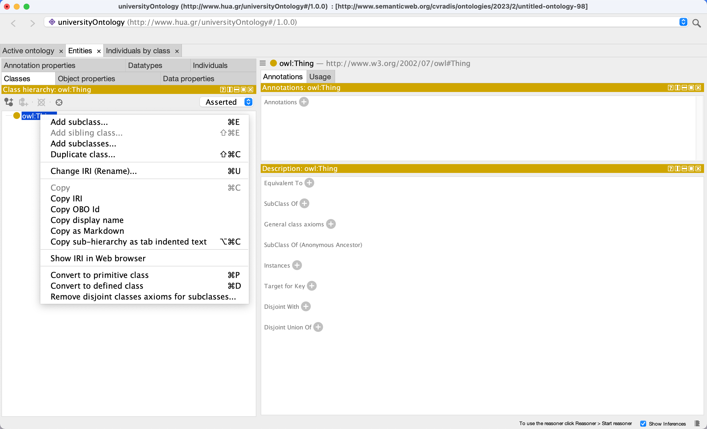

---
# Προσθήκη υποκλάσεων (subclasses)

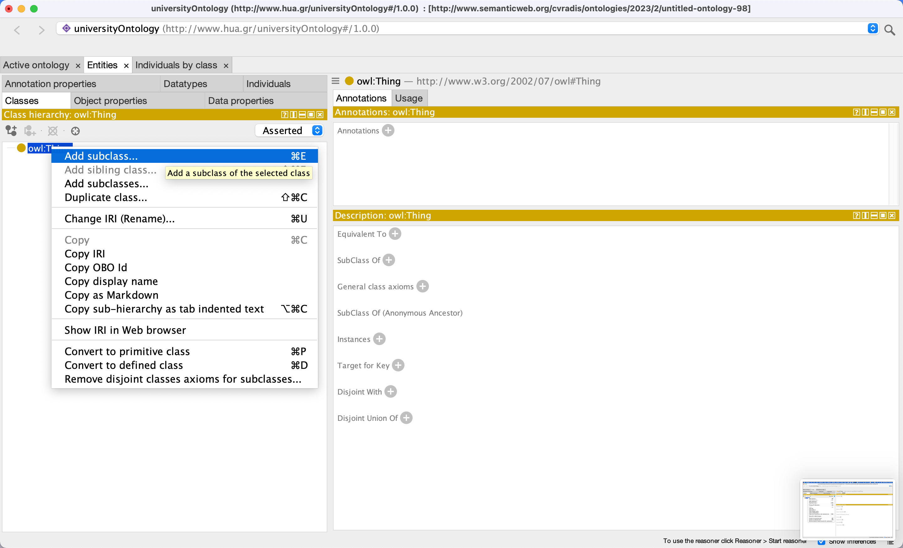

---
# Προσθήκη υποκλάσεων (subclasses)

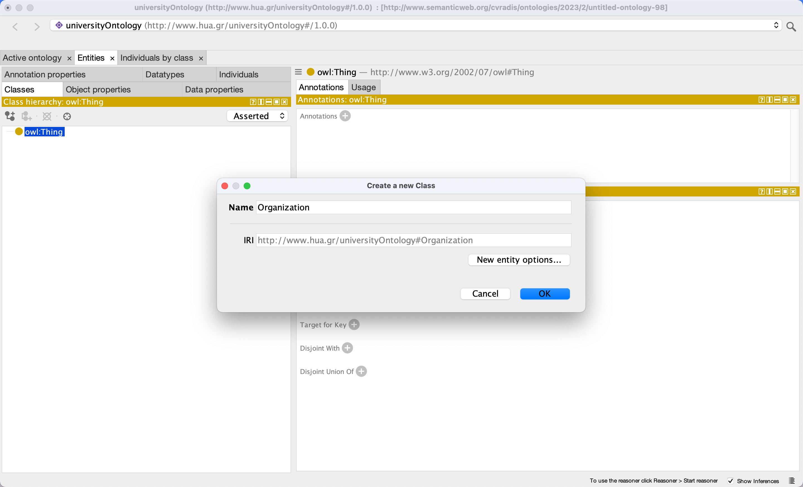

---
# Προσθήκη υποκλάσεων (subclasses)

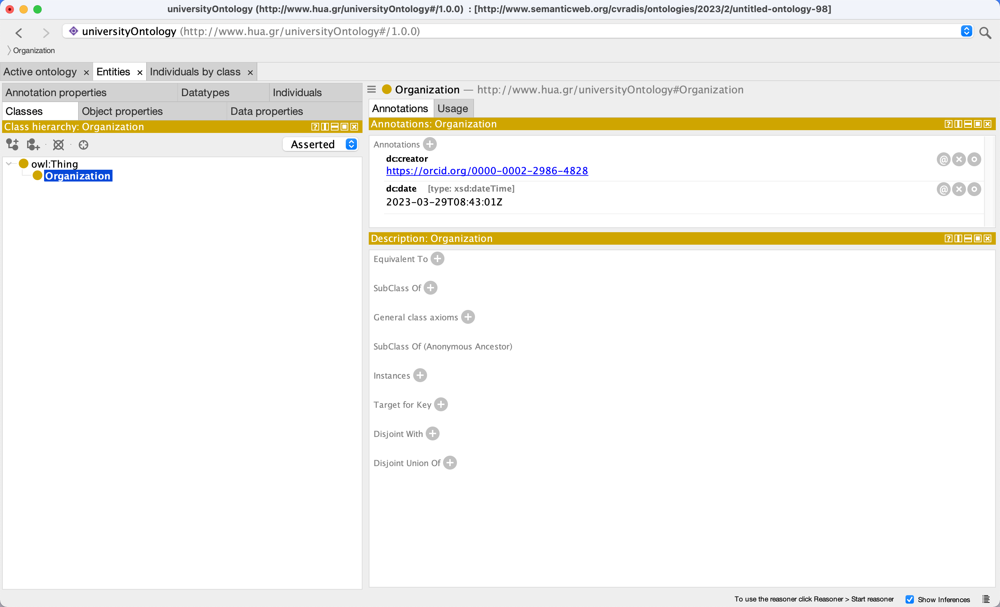

---
# Προσθήκη υποκλάσεων (subclasses)

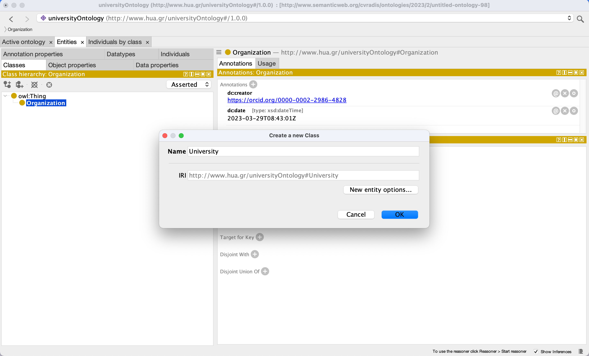

---
# Προσθήκη υποκλάσεων (subclasses)

Μετά την ολοκλήρωση όλων των βημάτων που απαιτούνται για την δημιουργία όλων των κλάσεων και υποκλάσεων, η τελική ιεραρχία, η  οποία, όπως προαναφέρθηκε ονομάζεται [ταξινομία (taxonomy)](https://en.wikipedia.org/wiki/Taxonomy), θα είναι η παρακάτω:

---
# Προσθήκη υποκλάσεων (subclasses)

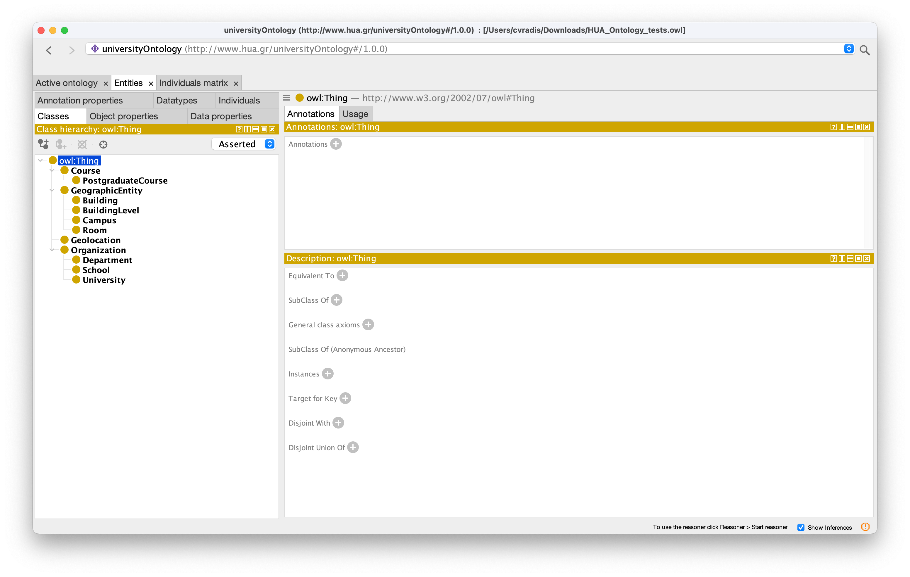

---

# Προσθήκη σχέσεων μεταξύ κλάσεων (Object Properties)

Το επόμενο λογικό βήμα για την ανάπτυξη της οντολογίας είναι ο καθορισμός των **σχέσεων** μεταξύ των κλάσεων. Στην ορολογία της OWL και του Protege, οι σχέσεις αυτές ονομάζονται **"Object Properties"** και σε αυτές έχουμε πρόσβαση από την ομώνυμη καρτέλα.

Με την ίδια λογική όπως και με την προσθήκη κλάσεων, οι σχέσεις μπορεί να σχηματίζουν μια ιεραρχία: π.χ. μπορούμε να δημιουργήσουμε μια γενικού τύπου σχέση με τη ονομασία "hasPart" για να υποδηλώσουμε γενικές μερολογικές σχέσεις μεταξύ ορισμένων κλάσεων της οντολογίας μας. Η προσθήκη της σχέσης γίνεται με δεξί κλικ στην βασική σχέση `owl:TopObjectProperty` (η οποία αποτελεί την βασική σχέση της οντολογίας, κάτω από την οποία θα προστεθούν όλες οι νέες σχέσεις):

---

# Προσθήκη σχέσεων μεταξύ κλάσεων (Object Properties)

---
# Προσθήκη σχέσεων μεταξύ κλάσεων (Object Properties)

Στη συνέχεια, ακολουθεί η προσθήκη των υπολοίπων σχέσεων. 

Οι σχέσεις που θα προστεθούν θα έχουν προκύψει από την προηγηθείσα σημασιολογική ανάλυση του πρωτογενούς κειμένου το οποίο προσπαθούμε να μοντελοποιήσουμε. 

Π.χ. για να προσθέσουμε τη σχέση `hasSchool` η οποία συνδέει την κλάση `University` με την κλάση `School`, κάνουμε δεξί κλικ στην σχέση `hasPart` (της οποίας αποτελεί εξειδίκευση) και πληκτρολογούμε την ονομασία της:

---
# Προσθήκη σχέσεων μεταξύ κλάσεων (Object Properties)

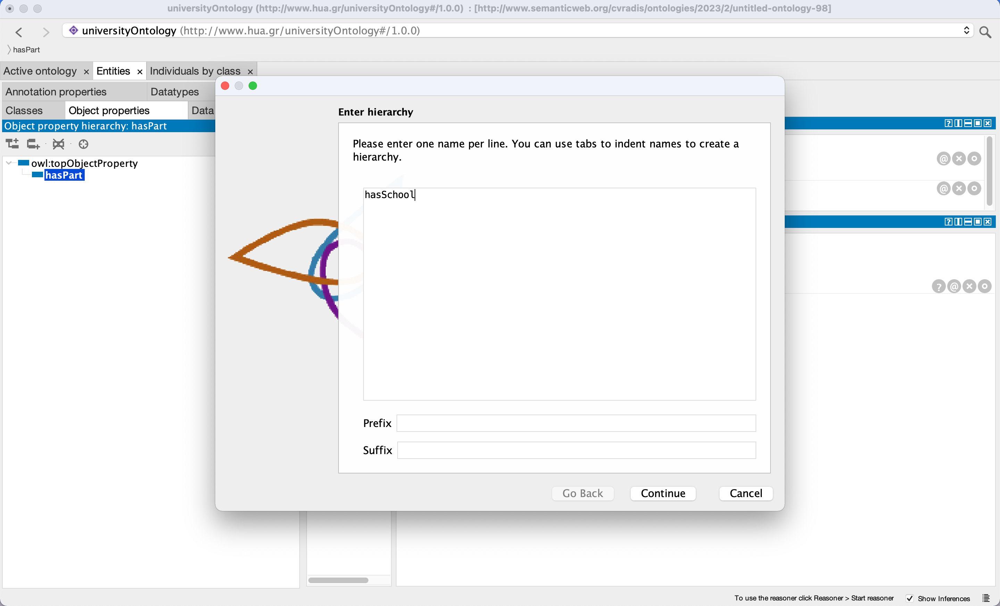

---

# Προσθήκη σχέσεων μεταξύ κλάσεων (Object Properties)

Όπως και με τις κλάσεις, προτιμούμε να χρησιμοποιούμε τις ονομασίες που θα αποτελούν μέρος των IRI στα αγγλικά. 

Στη συνέχεια, για να δηλώσουμε ότι αυτή η σχέση (`hasSchool`) μπορεί να σχετίζει τις παραπάνω δύο κλάσεις (`University` και `School`), χρησιμοποιούμε τις επιλογές "Domain" και "Range" αντίστοιχα από το δεξιά κάτω ενότητα "Description: hasSchool" πατώντας κάθε φορά στο πλήκτρο "+".

---

# Προσθήκη σχέσεων μεταξύ κλάσεων (Object Properties)

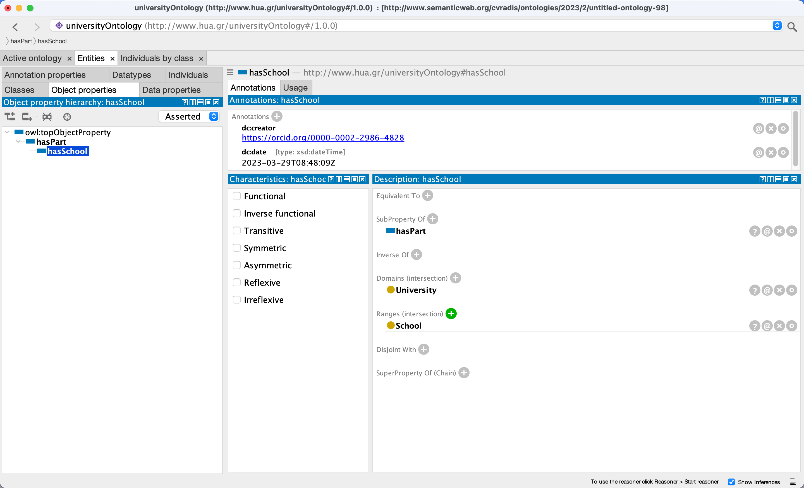

---

# Προσθήκη σχέσεων μεταξύ κλάσεων (Object Properties)

Στο σημείο αυτό να αναφέρουμε ότι το προηγούμενο βήμα  δεν είναι πάντα υποχρεωτικό: εφόσον είμαστε απόλυτα βέβαιοι ότι η σχέση που δημιουργήσαμε συνδέει αυτές τις δύο κλάσεις και μόνο, τότε έχει νόημα να περιορίσουμε το Domain και το Range της σχέσης.

Οι υπόλοιπες σχέσεις που αναγνωρίσαμε είναι οι ακόλουθες:

- `accommodates`
- `hasPart`
    - `hasBuilding`	
    - `hasDepartment`
    - `hasGeolocation`	
    - `hasLevel`
    - `hasRoom`
    - `hasSchool`
- `attends`
- `isAttendedBy`	
- `isHousedAt`
    - `isHousedAtCampus`	
    - `isHousedInBuilding`	
- `isLocatedAtSpecificLocation`
- `isTaughtAt`
- `partOf`

---

# Προσθήκη σχέσεων μεταξύ κλάσεων (Object Properties)

Η αξία της δημιουργίας ιεραρχίας σχέσεων (η οποία δεν είναι υποχρεωτική) θα φανεί αργότερα, κατά την υποβολή ερωτημάτων με τη χρήση της γλώσσας SPARQL.

Ακολουθώντας τα ίδια βήματα, προσθέτουμε τις νέες σχέσεις, φροντίζοντας να ακολουθήσουμε την ιεραρχία των σχέσεων που ήδη έχουμε αναγνωρίσει, και κάθε φορά ορίζουμε το Domain και το Range της εκάστοτε σχέσης. 

Η τελική ιεραρχία των σχέσεων μας θα είναι η ακόλουθη:

---
# Προσθήκη σχέσεων μεταξύ κλάσεων (Object Properties)

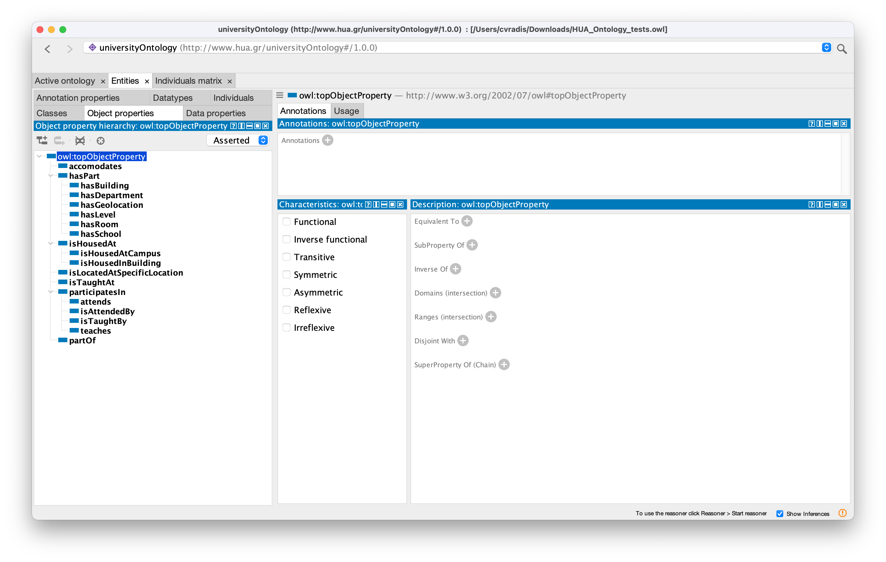

---
# Προσθήκη σχέσεων μεταξύ κλάσεων (Object Properties)

Για να δει κανείς τους περιορισμούς που έχουν οριστεί σε κάθε σχέση (Domain και Range) μπορεί να ανατρέξει στο αρχείο [HUA_Ontology.owl](HUA_Ontology.owl).

---

# Προσθήκη σχέσεων προς απλές τιμές (Data Properties)

Για την συσχέτιση κλάσεων όχι με κάποια άλλη κλάση αλλά με κάποια συγκεκριμένη τιμή (θα μπορούσε να είναι μια αριθμητική τιμή, μια αλφαριθμητική σειρά κ.α.) η γλώσσα OWL χρησιμοποιεί τις σχέσεις τύπου **"Data Properties"**, οι οποίες είναι προσβάσιμες από την αντίστοιχη καρτέλα.

Τα προκαθορισμένα είδη τιμών που χρησιμοποιούνται στις σχέσεις αυτές προέρχονται, κατά κύριο λόγο από τον χώρο ονομάτων XSD και είναι διαθέσιμες στην καρτέλα **"Datatypes"**.

---

# Προσθήκη σχέσεων προς απλές τιμές (Data Properties)

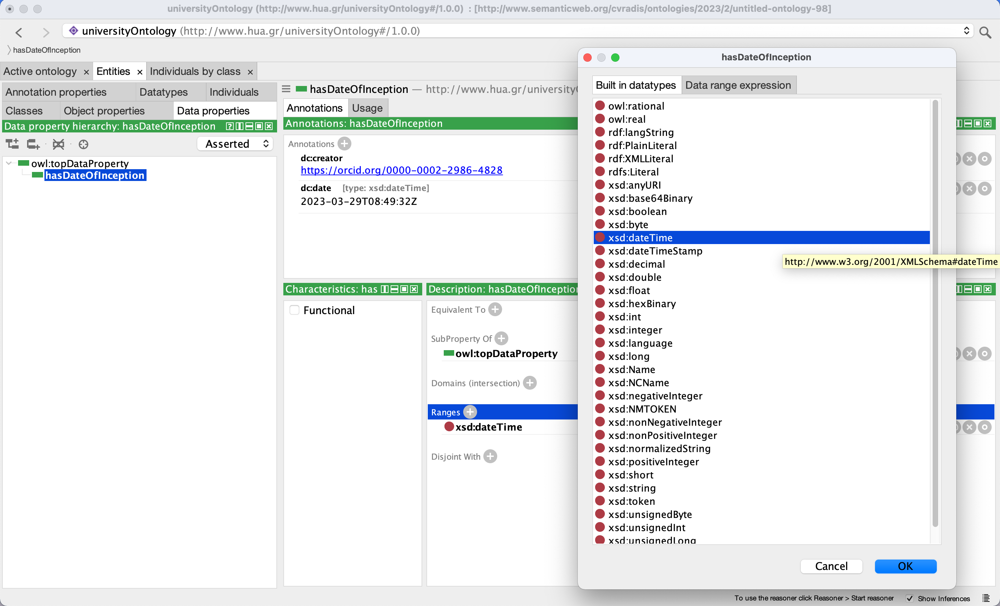

---

# Προσθήκη σχέσεων προς απλές τιμές (Data Properties)

Η προσθήκη των σχέσεων αυτών γίνεται ακολουθώντας την ίδια λογική, και μπορεί (εφόσον θεωρείται σκόπιμο) να αποτελέσουν μαι ιεραρχία. Οι σχέσεις που θα προστεθούν φαίνονται στο παρακάτω στιγμιότυπο:

---

# Προσθήκη σχέσεων προς απλές τιμές (Data Properties)

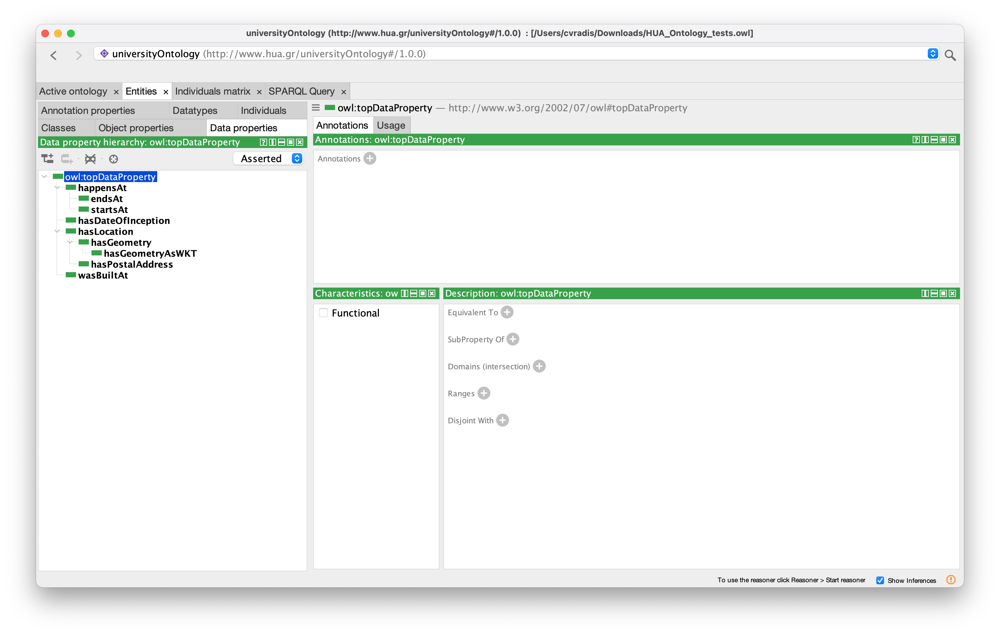

---

# Προσθήκη σχέσεων προς απλές τιμές (Data Properties)

Για να δει κανείς τους περιορισμούς που έχουν οριστεί σε κάθε σχέση (Domain και Data type) μπορεί να ανατρέξει στο αρχείο [HUA_Ontology.owl](HUA_Ontology.owl).

---

# Προσθήκη πραγματώσεων/περιπτώσεων (individuals)

Ως ένα από τα τελευταία στάδια στην ανάπτυξη της οντολογίας αποτελεί η προσθήκη των αντικειμένων του πραγματικού κόσμου, τα οποία στην OWL ονομάζονται **"Individuals"**, προσβάσιμα από την ομώνυμη καρτέλα.

---

# Προσθήκη πραγματώσεων/περιπτώσεων (individuals)

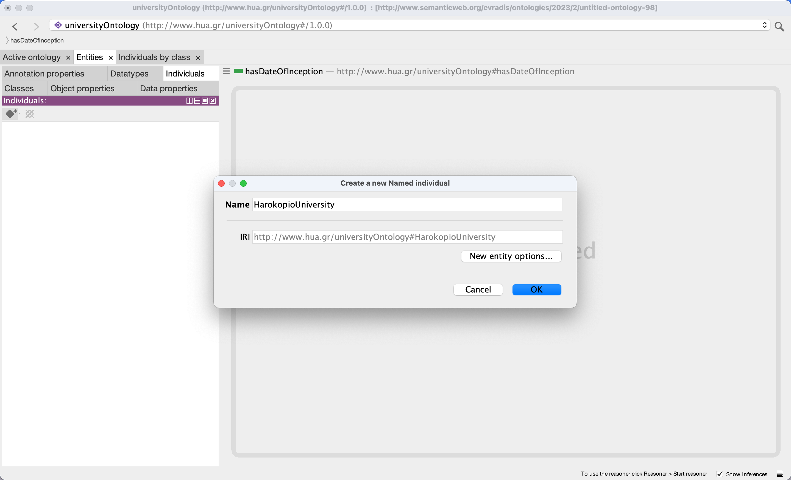

---

# Προσθήκη πραγματώσεων/περιπτώσεων (individuals)

Για τους σκοπούς του tutorial θα προστεθούν τα παρακάτω individuals:

- `HarokopioUniversity`: το Χαροκόπειο Πανεπιστήμιο
- `SchoolOfEnvironmentGeographyAndAppliedEconomics`: Η Σχολή Περιβάλλοντος, Γεωγραφίας και Εφαρμοσμένων Οικονομικών
- `GeographyDepartment`: Το Τμήμα Γεωγραφίας

- `mainHarokopioCampus`: οι κύριες εγκαταστάσεις του Πανεπιστημίου στην οδό Θησέως
- `mainHarokopioCampusGeolocation`: ο γεωχωρικός εντοπισμός των κύριων εγκαταστάσεων

- `geographyBuilding`: το κτήριο Γεωγραφίας
- `geographyBuildingGeolocation`: ο γεωχωρικός εντοπισμός του κτηρίου Γεωγραφίας
- `geographyBuildingMinusTwoLevel`: το τελευταίο επίπεδο του κτηρίου Γεωγραφίας

- `PostgraduateLaboratory`: η αίθουσα του εργαστηρίου του Μεταπτυχιακού Προγράμματος
- `ResearchThemesInGeoinformationTechnologyCourse`: το μάθημα "Ερευνητικά Θέματα στη Γεωπληροφορική"

---

# Προσθήκη πραγματώσεων/περιπτώσεων (individuals)

Και στην περίπτωση των individuals χρησιμοποιούμε αγγλικές ονομασίες οι οποίες θα αποτελέσουν μέρος των μοναδικών αναγνωριστικών IRI.

Αξίζει να σημειωθεί ότι κατά την εισαγωγή των individuals δεν μπορεί να σχηματισθεί κάποια ιεραρχική δομή, όπως συμβαίνει με τις κλάσεις και τις σχέσεις. Αν αυτό ήταν επιθυμητό, θα πρέπει να γίνει μέσω της δήλωσης σχέσης η οποία πρέπει να ορισθεί επίσης ως **αυτοπαθής (reflexive)**, δηλαδή να έχει ως Domain και Range την ίδια κλάση.

Σε όλες τις περιπτώσεις των οντοτήτων της οντολογίας μας (classes, object properties, data properties, individuals) μπορούμε να προσθέσουμε επισημάνσεις (annotations) οι οποίες στοχεύουν στην απόδοση ονομάτων, σχολίων και άλλων χαρακτηριστικών σε αυτά. Τα Annotations είναι ουσιαστικά σχέσεις, οι οποίες στο ένα άκρο μπορεί να αναφέρονται σε οποιασδήποτε σχεδόν οντότητα και στο άλλο άκρο να σχετίζουν μια συγκεκριμένη τιμή (Literal). Η προσθήκη annotations γίνεται από την ενότητα **"Annotations"** η οποία υπάρχει σε κάθε είδος οντότητας. Μία από τις (σχεδόν επιβεβλημένες) επισημάνσεις που μπορούμε να προσθέσουμε είναι οι ονομασίες σε διάφορες γλώσσες, με την ιδιότητα `rdfs:label`:

---

# Προσθήκη πραγματώσεων/περιπτώσεων (individuals)

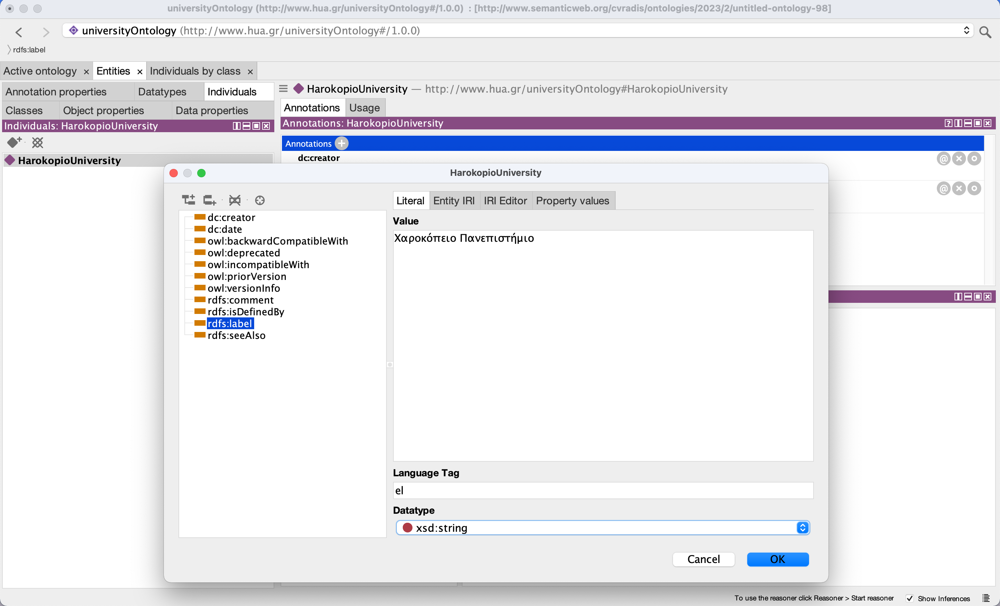

---

# Προσθήκη πραγματώσεων/περιπτώσεων (individuals)

Αν το Literal που χρησιμοποιείται είναι τύπου `xsd:string` (αλφαριθμητική τιμή) μπορεί να προστεθεί και η γλώσσα στην οποία αναφέρεται (en για αγγλικά, el για ελληνικά κ.ο.κ.)

Με παρόμοιο τρόπο μπορεί κανείς να προσθέσει σχόλια χρησιμοποιώντας το annotation `rdfs:comment`, εξωτερικούς συνδέσμους με το `rdfs:seeAlso` κ.λπ.

Μετά την προσθήκη κάθε individual, το επόμενο λογικό βήμα είναι να καθορίσουμε την κλάση στην οποία ανήκει. Για παράδειγμα, το individual `SchoolOfEnvironmentGeographyAndAppliedEconomics` ανήκει στην κλάση `School`. Ο ορισμός αυτός γίνεται από την επιλογή "Types":

---

# Προσθήκη πραγματώσεων/περιπτώσεων (individuals)

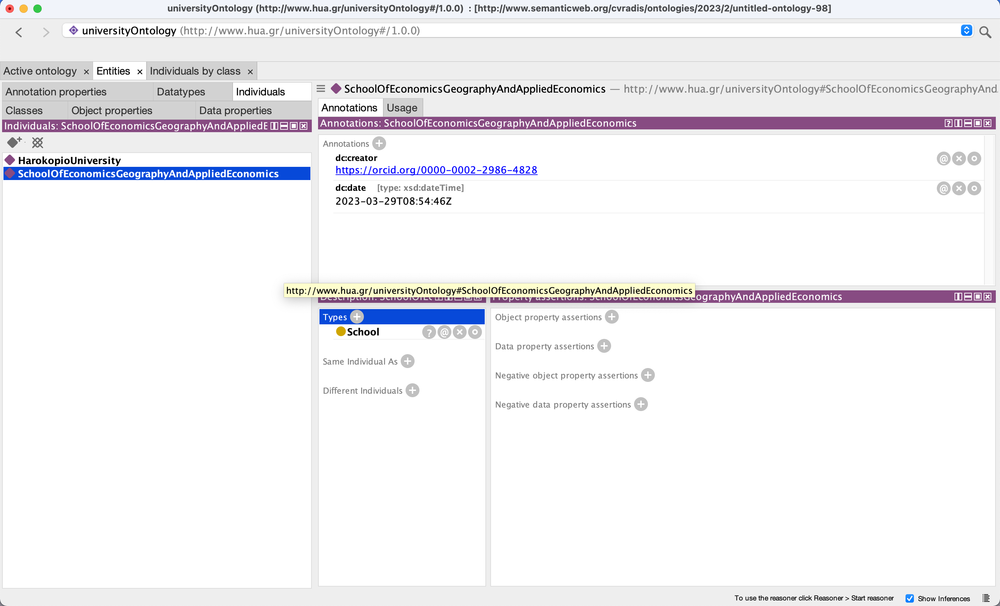

---

# Προσθήκη πραγματώσεων/περιπτώσεων (individuals)

Αφού έχουμε εισάγει ένα individual και έχουμε ορίσει την κλάση στην οποία ανήκει, μπορούμε στη συνέχεια να εισάγουμε τις σχέσεις του με άλλα individuals. Η διαδικασία αυτή γίνεται από την επιλογή **"Object property assertions"** (Δηλώσεις σχέσεων μεταξύ αντικειμένων):

---

# Προσθήκη πραγματώσεων/περιπτώσεων (individuals)

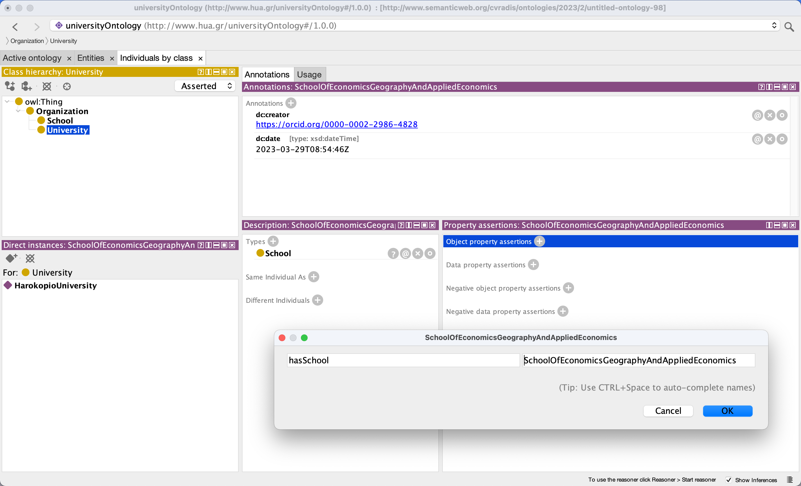

---

# Προσθήκη πραγματώσεων/περιπτώσεων (individuals)

Με την ολοκλήρωση της εισαγωγής των individuals, η οντολογία θα φαίνεται όπως στο παρακάτω στιγμιότυπο:

---

# Προσθήκη πραγματώσεων/περιπτώσεων (individuals)

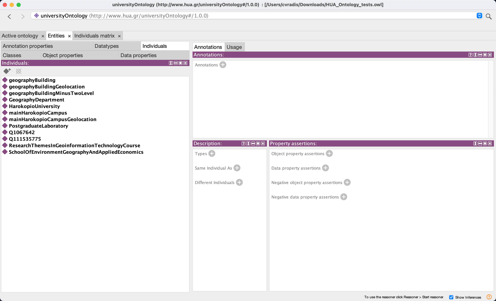

---

# Προσθήκη class και individual εξωτερικής προέλευσης

Προκειμένου να διασυνδέσουμε την οντολογία μας με δομημένα δεδομένα εξωτερικής προέλευσης, και άρα να θεωρηθούν ως Ανοκτά Διασυνδεδεμένα Δεδομένα 5 αστέρων (βλ. και το [εισαγωγικό κείμενο](../README.md)), θα αναζητήσουμε δεδομένα από το [Wikidata](https://www.wikidata.org/wiki/Wikidata:Main_Page), το οποίο αποτελεί μια ελεύθερη και ανοιχτή **γνωσιακή βάση δομημένων δεδομένων**, τα οποία μπορούν να αναγνωστούν και επεξεργαστούν τόσο από ανθρώπους όσο και από μηχανές.

Με αναζήτηση ελεύθερου κειμένου στο Wikidata, μπορούμε να ανακαλύψουμε, μεταξύ πολλών άλλων, δύο εγγραφές που μας ενδιαφέρουν, οι οποίες θα χρησιμοποιηθούν ως παράδειγμα διασύνδεσης:

- την έννοια University (Πανεπιστήμιο): https://www.wikidata.org/wiki/Q3918
- την εγγραφή για το ίδιο το Χαροκόπειο Πανεπιστήμιο: https://www.wikidata.org/wiki/Q1067642

Οι παραπάνω σύνδεσμοι λειτουργούν ως URL μέσω των οποίων είναι προσβάσιμες σελίδες HTML αναγνώσιμες από τον άνθρωπο. Για να εντοπίσουμε όμως το σωστό IRI για κάθε μία από τις παραπάνω εγγραφές, το οποίο δεν θα αναφέρεται στη σελίδα (ως διαδικτυακό πόρο) αλλά στην εκάστοτε έννοια (concept) θα χρησιμοποιήσουμε το σύνδεσμο **"Concept URI"** από το δεξί κατακόρυφο μενού της κάθε σελίδας. Συνεπώς, τα IRI που πρέπει να χρησιμοποιήσουμε είναι τα παρακάτω:

- http://www.wikidata.org/entity/Q3918, για την έννοια University (Πανεπιστήμιο)
- http://www.wikidata.org/entity/Q1067642, για την εγγραφή για το ίδιο το Χαροκόπειο Πανεπιστήμιο

---

# Προσθήκη της κλάσης "Q3918" από το Wikidata (εγγραφή για την έννοια "University")

Για να εισάγουμε την έννοια του Πανεπιστημίου από το Wikidata, μεταβαίνουμε στην ενότητα "Classes" και με δεξί κλικ στην βασική κλάση `owl:Thing` προσθέτουμε την νέα, εξωτερική κλάση όπως στο στιγμιότυπο:

---
# Προσθήκη της κλάσης "Q3918" από το Wikidata (εγγραφή για την έννοια "University")

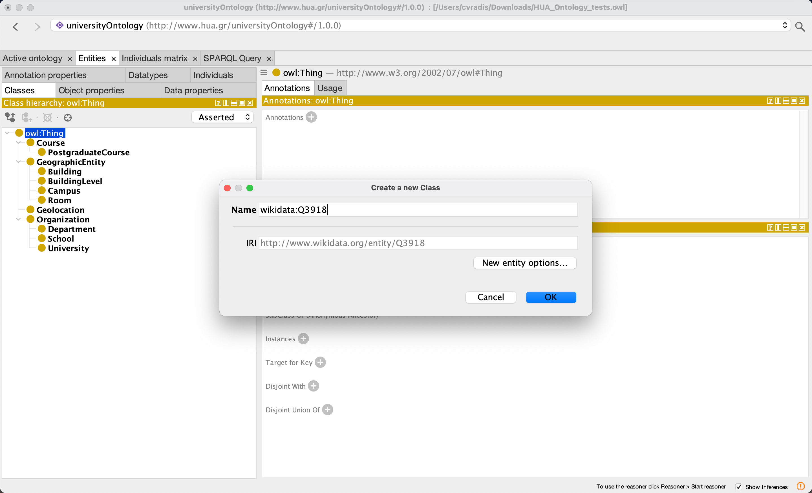

---

# Προσθήκη της κλάσης "Q3918" από το Wikidata (εγγραφή για την έννοια "University")

Επειδή το πρόθημα `wikidata` έχει ήδη οριστεί από προηγούμενο στάδιο, χρησιμοποιούμε την έκφραση `wikidata:Q3918` αντί για το πλήρες IRI (http://www.wikidata.org/entity/Q3918).  Στη συνέχεια, έχοντας επιλεγμένη την κλάση "Q3918" και πατώντας στην επιλογή **"Equivalent to"** επιλέγουμε την κλάση `University` που είχαμε προσθέσει στα αρχικά βήματα. 

---

# Προσθήκη της κλάσης "Q3918" από το Wikidata (εγγραφή για την έννοια "University")

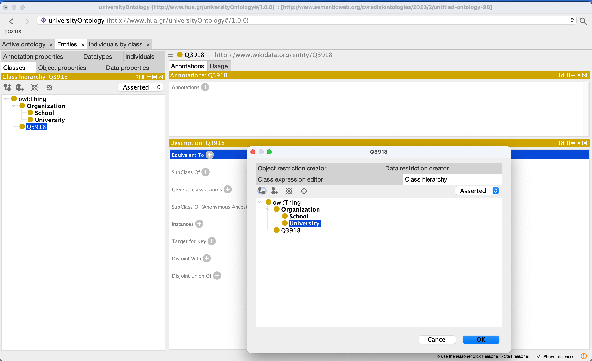

---

# Προσθήκη της κλάσης "Q3918" από το Wikidata (εγγραφή για την έννοια "University")

Με την ενέργεια αυτή, δηλώνουμε ότι οι δύο κλάσεις είναι πλήρως ισοδύναμες. Το εικονίδιο και στις δύο κλάσεις θα αλλάξει (όπως στο στιγμιότυπο) και θα προστεθεί η δήλωση ισοδυναμίας στις ονομασίες τους με το σύμβολο "=". Ως αποτέλεσμα, η νέα κλάση `Q3918` θα θεωρηθεί (αυτόματα) ως υποκλάση της κλάσης `Organization`

---

# Προσθήκη της κλάσης "Q3918" από το Wikidata (εγγραφή για την έννοια "University")

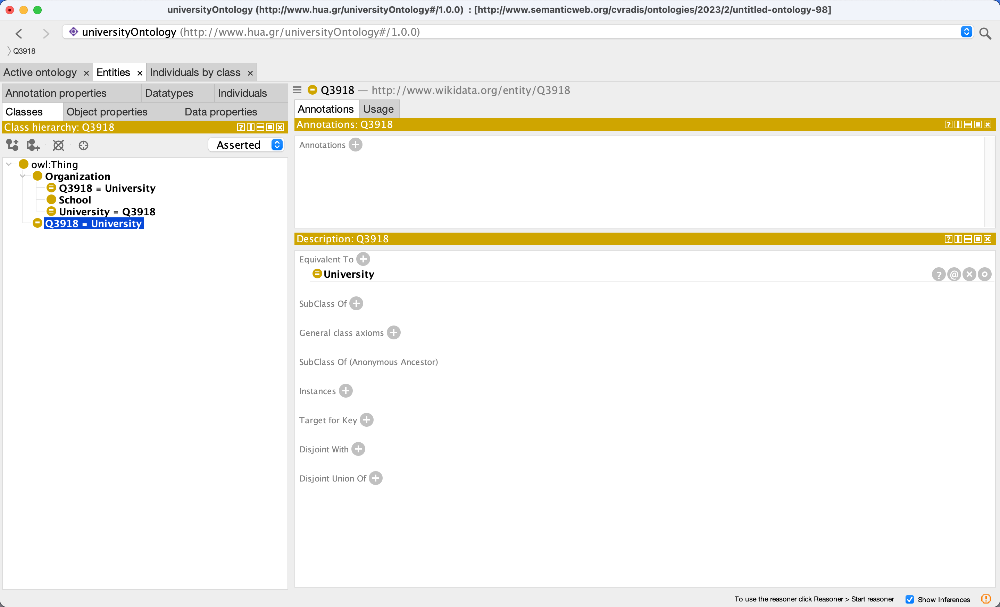

---

# Προσθήκη του individual "Q1067642" από το Wikidata (εγγραφή για το "Χαροκόπειο Πανεπιστήμιο")

Με την ίδια λογική, μεταβαίνουμε στην ενότητα "Individuals" για να προσθέσουμε την εγγραφή της Wikidata για το Χαροκόπειο Πανεπιστημιο (Q1067642). Το νέο individual θα προστεθεί ως `wikidata:Q1067642` όπως στο παρακάτω στιγμιότυπο:

---

# Προσθήκη του individual "Q1067642" από το Wikidata (εγγραφή για το "Χαροκόπειο Πανεπιστήμιο")

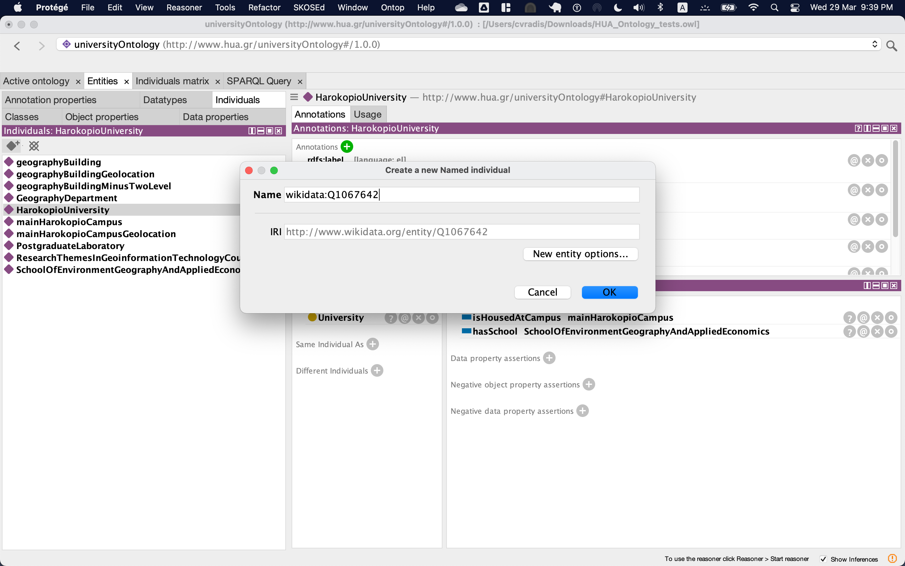

---

# Προσθήκη του individual "Q1067642" από το Wikidata (εγγραφή για το "Χαροκόπειο Πανεπιστήμιο")

Για να δηλώσουμε ότι το νέο και εξωτερικό individual είναι ταυτόσημο με το individual του Χαροκοπείου Πανεπιστημίου που έχουμε προσθέσει ήδη στην οντολογία μας, χρησιμοποιούμε την επιλογή **"Same individual as"** και επιλέγουμε το individual `HarokopioUniversity`.

---
# Προσθήκη του individual "Q1067642" από το Wikidata (εγγραφή για το "Χαροκόπειο Πανεπιστήμιο")

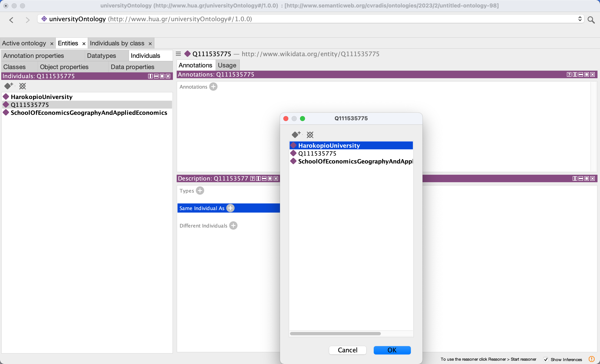

---

# Ενεργοποίηση του συλλογιστή (reasoner) και παραγωγή συμπερασμών

Για να ενεργοποιήσουμε τον συλλογιστή, από το κυρίως μενού επιλέγουμε **Reasoner**, και επιλέγουμε έναν από τους διαθέσιμους συλλογιστές (οι οποίοι υπάρχουν ήδη στο Protégé ως plugins). Στη συνέχεια, από το ίδιο μενού επιλέγουμε "Start Reasoner" Εφόσον δεν υπάρχει κάποια λογική ασυνέπεια στην οντολογία μας (για την οποία ενδέχεται να εμφανιστεί μήνυμα σφάλματος), μπορούμε να μεταβούμε στην ενότητα "Individuals" και να επιλέξουμε την εξωτερική εγγραφή της Wikidata για το Χαροκόπειο (`Q10676421`). Στο δεξί μέρος της οθόνης θα δούμε τα "συμπεράσματα" που έχει δημιουργήσει ο συλλογιστής για την εγγραφή αυτή: εφόσον θεωρείται ταυτόσημη με το individual `HarokopioUniversity` θα ισχύουν οι ίδιες δηλώσεις που ισχύουν για αυτό.

---

# Ενεργοποίηση του συλλογιστή (reasoner) και παραγωγή συμπερασμών

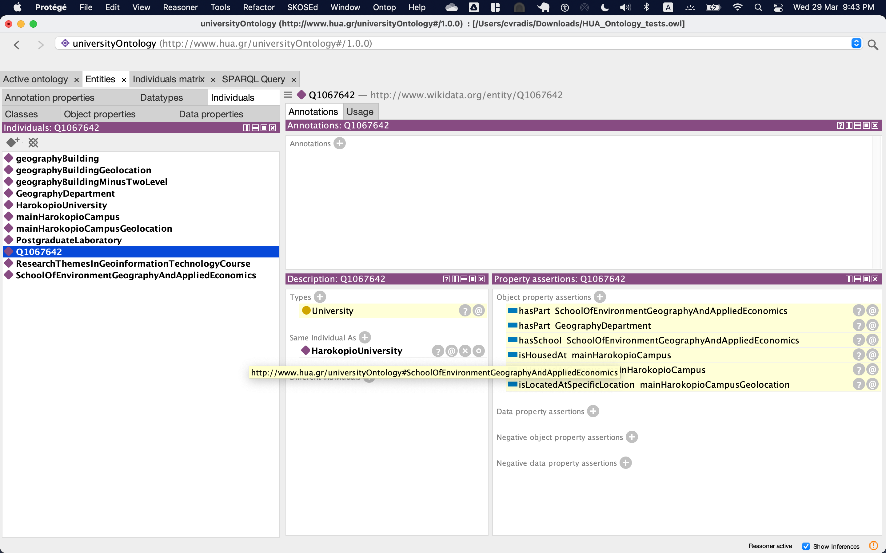

---

# Ενεργοποίηση του συλλογιστή (reasoner) και παραγωγή συμπερασμών

Αν μεταβούμε και στις υπόλοιπες ενότητες (classes, object properties, data properties) μπορούμε να δούμε ποια άλλα νέα συμπεράσματα έχουν προκύψει από το σύνολο των δηλώσεών μας.

Στο σημείο αυτό ολοκληρώνεται το tutorial. Φυσικά, ο ενδιαφερόμενος/η αναγνώστης/τρια μπορεί να συνεχίσει και να προσθέσει και άλλες δηλώσεις στην οντολογία ακολουθώντας παρόμοια βήματα με αυτά που περιγράφηκαν παραπάνω.

---
# Δεδομένα που αξιοποιήθηκαν σε μορφή ελεύθερου κειμένου

## Σχετικά με το Χαροκόπειο Πανεπιστήμιο

(Πηγές: [1](https://www.hua.gr/index.php/el/university-3/deans-history), [2](https://www.hua.gr/index.php/el/university-3/premises), [3](https://www.hua.gr/), [4](https://overpass-turbo.eu), [5](https://www.ktimanet.gr/geoportal/rest/document?id=%7B3DE46469-97B1-46D4-A8DB-03D9BA80F523%7D))

Το `Χαροκόπειο Πανεπιστήμιο` αποτελεί, κατά χρονολογική σειρά ιδρύσεως, το 18ο `Α.Ε.Ι`. της χώρας. Ιδρύθηκε με το άρθρ. 9 του Ν.1894/90 όπως τροποποιήθηκε με το άρθρ. 17 του Ν. 1966/91 με πρωτοβουλία του Καθηγητή Γεωργίου Καραμπατζού (†2011). Το Χαροκόπειο Πανεπιστήμιο φέρει το όνομα του εθνικού ευεργέτη Παναγή Χαροκόπου. Σήμερα το Πανεπιστήμιο διαθέτει τρείς Σχολές: 
- τη `Σχολή Περιβάλλοντος, Γεωγραφίας και Εφαρμοσμένων Οικονομικών`, 
- τη Σχολή Επιστημών Υγείας και Αγωγής, καθώς και 
- τη Σχολή Ψηφιακής Τεχνολογίας. 
 
Διαθέτει τέσσερα `προπτυχιακά` `Τμήματα`: 
- το Τμήμα Οικιακής Οικονομίας και Οικολογίας, της Σχολής Περιβάλλοντος, Γεωγραφίας και Εφαρμοσμένων Οικονομικών, που λειτουργεί από το 1993, 
- το Τμήμα Επιστήμης Διαιτολογίας – Διατροφής (από το 1994) της Σχολής Επιστημών Υγείας και Αγωγής, 
- το `Τμήμα Γεωγραφίας` (από το 2000) της `Σχολής Περιβάλλοντος, Γεωγραφίας και Εφαρμοσμένων Οικονομικών` και 
- το Τμήμα Πληροφορικής και Τηλεματικής (από το 2007) της Σχολής Ψηφιακής Τεχνολογίας. 

---
# Δεδομένα που αξιοποιήθηκαν σε μορφή ελεύθερου κειμένου

## Σχετικά με το Χαροκόπειο Πανεπιστήμιο

Λειτουργούν επίσης και πέντε Προγράμματα Μεταπτυχιακών Σπουδών: 
- στο Τμήμα Οικιακής Οικονομίας και Οικολογίας το ΠΜΣ «Βιώσιμη Ανάπτυξη» και «Εκπαίδευση και Πολιτισμός», 
- στο Τμήμα Επιστήμης Διαιτολογίας – Διατροφής το ΠΜΣ «Εφαρμοσμένη Διαιτολογία – Διατροφή», 
- στο Τμήμα Γεωγραφίας το `ΠΜΣ` `«Εφαρμοσμένη Γεωγραφία και Διαχείριση του Χώρου»` και 
- στο Τμήμα Πληροφορικής και Τηλεματικής το ΠΜΣ «Πληροφορική και Τηλεματική».

Στο Χαροκόπειο Πανεπιστήμιο λειτουργεί επίσης `Βιβλιοθήκη` και `Κέντρο Πληροφόρησης`.

---
# Δεδομένα που αξιοποιήθηκαν σε μορφή ελεύθερου κειμένου
## Σχετικά με το Χαροκόπειο Πανεπιστήμιο

### Χώροι και εγκαταστάσεις του Πανεπιστημίου

Οι `κεντρικές εγκαταστάσεις` του Πανεπιστημίου βρίσκονται επί της `οδού Ελ. Βενιζέλου 70 στην Καλλιθέα`. Το κτηριακό συγκρότημα χωροθετείται εντός δενδρόφυτου `αστικού ακινήτου`, που καταλαμβάνει έκταση είκοσι περίπου στρεμμάτων, και περιλαμβάνει κυρίως το `κεντρικό κτήριο`, το οποίο αναπαλαιώθηκε και ανακαινίσθηκε κατά τα έτη 1993-94 και σήμερα στεγάζει:
- αίθουσες διδασκαλίας, 
- το κεντρικό αμφιθέατρο, 
- εργαστήρια, καθώς και 
- τις διοικητικές υπηρεσίες του Πανεπιστημίου. 

Η ανέγερση και κατασκευή του πραγματοποιήθηκε κατά τα έτη 1915-1920, ενώ το 1959 προστέθηκε μια νέα πτέρυγα. Στο κτηριακό αυτό συγκρότημα στεγάσθηκε το 1929 η «Χαροκόπειος Ανωτάτη Σχολή», η οποία έπαυσε τη λειτουργία της το 1990. Το έτος 2000, η κτηριακή υποδομή του Πανεπιστημίου συμπληρώθηκε με την ανέγερση ενός νέου σύγχρονου κτηρίου, που περιλαμβάνει 
- τη «Βιβλιοθήκη και Κέντρο Πληροφόρησης», 
- την αίθουσα τελετών,
- πλήρως εξοπλισμένα εργαστήρια, 
- αίθουσες διδασκαλίας και 
- γραφεία καθηγητών, ως επί το πλείστον του τμήματος Γεωγραφίας.

---
# Δεδομένα που αξιοποιήθηκαν σε μορφή ελεύθερου κειμένου

## Σχετικά με το Χαροκόπειο Πανεπιστήμιο

Το 2011 το Πανεπιστήμιο απέκτησε ένα ακόμη ιδιόκτητο κτήριο στην περιοχή του Ταύρου (Ομήρου 9) που στεγάζει 
- το Τμήμα Πληροφορικής και Τηλεματικής καθώς και 
- το Φοιτητικό Εστιατόριο. 

Συμπληρωματικά, οι ανάγκες του Πανεπιστημίου καλύπτονται και με ένα επιπλέον κτήριο, που βρίσκεται σε μικρή απόσταση από τις κεντρικές εγκαταστάσεις, στην οδό Χαροκόπου 89, που στεγάζει:
- αίθουσες διδασκαλίας και 
- γραφεία καθηγητών.

Το παραπάνω κείμενο προέρχεται (κυρίως) από τις παρακάτω σελίδες στον κεντρικό ιστότοπο του Πανεπιστημίου: [1](https://www.hua.gr/index.php/el/university-3/deans-history), [2]( https://www.hua.gr/index.php/el/university-3/premises).

---
# Δεδομένα που αξιοποιήθηκαν σε μορφή ελεύθερου κειμένου

## Γεωχωρικά δεδομένα

1. Χρησιμοποιώντας το OpenStreetMap και το εργαλείο [Overpass Turbo](https://overpass-turbo.eu) ανακτήθηκαν τα παρακάτω δεδομένα:

    1.1 οι (προσεγγιστικές) συντεταγμένες των κορυφών της έκτασης που καταλαμβάνει το **ακίνητο επί της οδού Θησέως 70**, οι οποίες είναι (υπό τη μορφή WKT): 
    `POLYGON ((23.7086415 37.9608528, 23.7093731 37.9613723, 23.7085558 37.9621219, 23.707038 37.9611242, 23.7078696 37.9603537, 23.7086415 37.9608528))`
    
    1.2 οι (προσεγγιστικές) συντεταγμένες των κορυφών της έκτασης που καταλαμβάνει το **κεντρικό κτήριο**: `POLYGON ((23.707997 37.961186, 23.708128 37.9610687, 23.7082125 37.9611273, 23.7081903 37.9611472, 23.7082654 37.9611993, 23.7083346 37.9612475, 23.708358 37.9612266, 23.7084543 37.9612937, 23.7083223 37.9614116, 23.7082004 37.9613268, 23.708118 37.9612699, 23.707997 37.961186))`

    1.3 οι (προσεγγιστικές) συντεταγμένες των κορυφών της έκτασης που καταλαμβάνει το **κτήριο του Κεντρικού Αμφιθεάτρου**: `POLYGON ((23.708118 37.9612699, 23.7082004 37.9613268, 23.7081585 37.9613657, 23.7081909 37.9613874, 23.7080002 37.9615644, 23.7078561 37.9614679, 23.7080472 37.9612905, 23.7080754 37.9613094, 23.708118 37.9612699))`

    1.4 οι (προσεγγιστικές) συντεταγμένες των κορυφών της έκτασης που καταλαμβάνει το **κτήριο Γεωγραφίας**: `POLYGON ((23.7077913 37.9608094, 23.7079726 37.9606444, 23.7081169 37.9607378, 23.7081469 37.9607121, 23.7082488 37.9607798, 23.7081502 37.9608783, 23.7080638 37.9608221, 23.7080141 37.9608686, 23.7080396 37.9609532, 23.7080101 37.9609595, 23.7077913 37.9608094))`

---
# Δεδομένα που αξιοποιήθηκαν σε μορφή ελεύθερου κειμένου

# Γεωχωρικά δεδομένα

2. Με τη βοήθεια των [διαδικτυακών υπηρεσιών](https://www.ktimanet.gr/geoportal/rest/document?id=%7B3DE46469-97B1-46D4-A8DB-03D9BA80F523%7D) του Εθνικού Κτηματολογίου ανακτήθηκαν τα παρακάτω δεδομένα: 

     2.1 οι συντεταγμένες (WGS84) των κορυφών για το **ακίνητο επί της οδού Ομήρου 9** είναι (υπό τη μορφή WKT): 
     `Polygon((23.70076050557143077 37.96241760277688826, 23.70092920622352395 37.96244058287212653, 23.70106434339509249 37.96245938476288018, 23.70107405913945087 37.96242038824335197, 23.70111910486331297 37.96221635254464388, 23.70085236351811986 37.96217735589605979, 23.70076050557143077 37.96241760277688826))`, ενώ ο αναγνωριστικός του κωδικός (ΚΑΕΚ) είναι 051381909012.

---
# Άδεια χρήσης

[Attribution-NonCommercial 4.0 International (CC BY-NC 4.0)]((https://creativecommons.org/licenses/by-nc/4.0/))

# Σχόλια και παρατηρήσεις

Κάθε σχόλιο είναι ευπρόσδεκτο. Χρησιμοποιείστε την ενότητα ["Issues"](https://github.com/c-vradis/protege_tutorial/issues) στο Github. 

# Συντελεστές

Χριστόφορος Βραδής, υποψήφιος διδάκτορας Τμήματος Γεωγραφίας Χαροκοπείου Πανεπιστημίου.