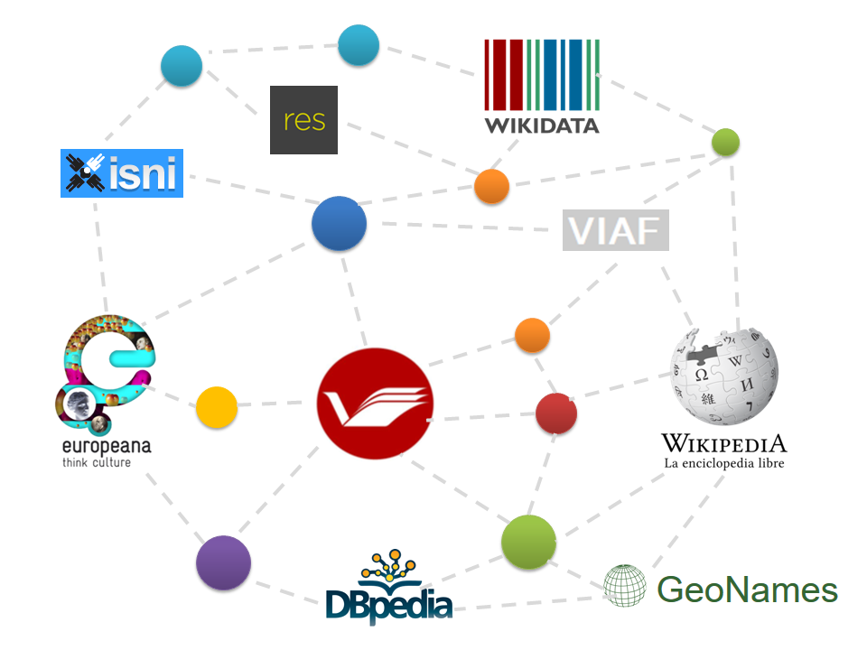
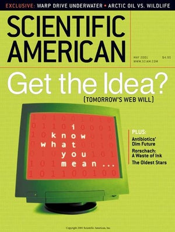
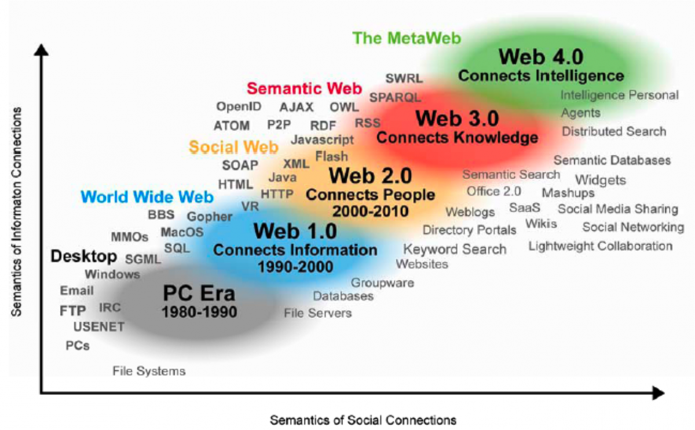
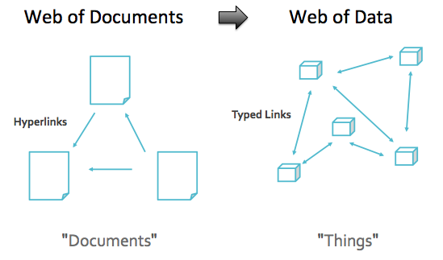
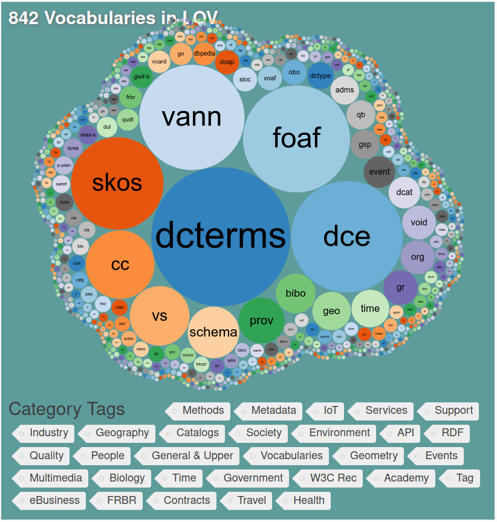
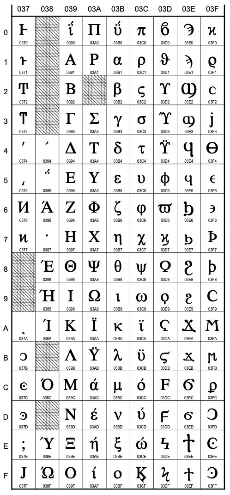
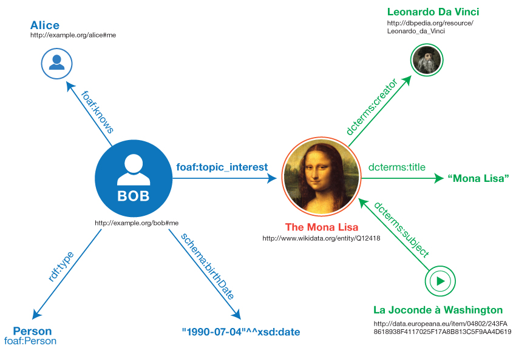
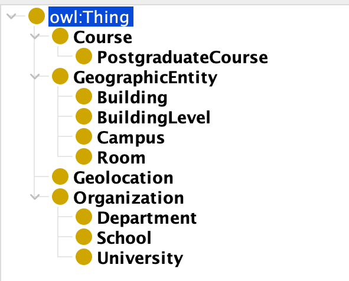
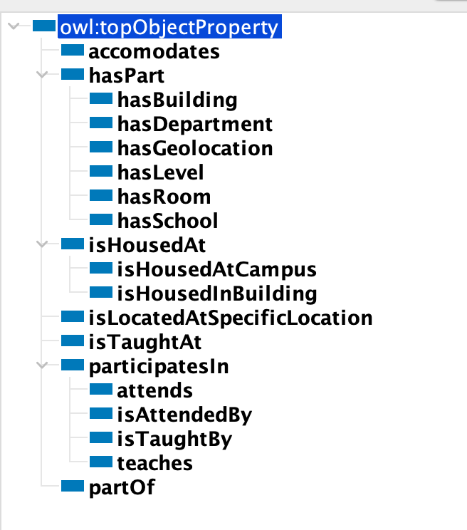
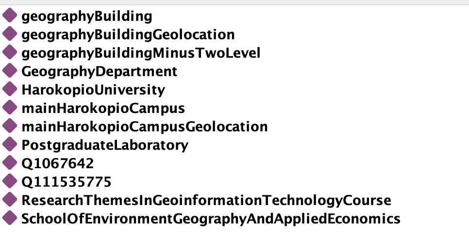

<style scoped>
{
    font-size: 17px;
    font-family: "Geologica";
    padding: 2rem 3rem 2rem 3rem;
}
footer {
    font-size: 1px;
    font-family: "Geologica";
    font-weight: 300;
}
</style>



# Ο Σημασιολογικός Ιστός και τα (Ανοικτά) Διασυνδεδεμένα Δεδομένα 
## Πώς τα δεδομένα δια-συνδέονται ώστε να γίνουν πιο αξιοποιήσιμα

Χαροκόπειο Πανεπιστήμιο, Τμήμα Γεωγραφίας, ΠΜΣ “Εφαρμοσμένη Γεωγραφία και Διαχείριση του Χώρου”, Ερευνητικά θέματα στη Γεωπληροφορική 

Χριστόφορος Βραδής, υποψήφιος διδάκτορας Τμήματος Γεωγραφίας Χαροκοπείου Πανεπιστημίου.

Μάρτιος 2025

---
<style>
{
    font-size: 18px;
    font-weight: 200;
    font-family: "Geologica";
    columns: 1;
    padding: 2rem 3rem 2rem 3rem;
    text-align:left;
    letter-spacing: normal;
}
footer {
    font-size: 12px;
    font-family: "Geologica";
    font-weight: 200;
    padding: 0 3rem 0 3rem;
}
</style>

# Δομή παρουσίασης

- **Ιστορικό & Θεωρία** → Παγκόσμιος Ιστός -> Σημασιολογικός Ιστός  
- **Βασικές Έννοιες** → LOD, Οντολογίες  
- **Τεχνολογικά Θεμέλια** → IRI/URI, Unicode, XML, RDF, OWL, SPARQL  
- **Πρακτική Εφαρμογή** → Δημιουργία οντολογίας στο Protégé  

Περιλαμβάνεται μια *εξαιρετικά* σύντομη εισαγωγή στη χρήση του λογισμικού [**Protégé**](https://protege.stanford.edu). Ως παράδειγμα χρησιμοποιούνται δεδομένα για το Χαροκόπειο Πανεπιστήμιο, τα Τμήματα, τις Σχολές και τις εγκαταστάσεις του και τα μαθήματα του μεταπτυχιακού προγράμματος. Στόχος της πρακτικής άσκησης είναι η δημιουργία μιας **οντολογίας** για την δημοσίευση (μέρους) των δεδομένων αυτών ως **Ανοικτά Διασυνδεδεμένα Δεδομένα** στον **Σημασιολογικό Ιστό**. 

---
# Εισαγωγή

Τα δεδομένα βρίσκονται πλέον παντού καθώς παράγουμε ολοένα και περισσότερο από αυτά σε καθημερινή βάση. Ως άτομα και ως ομάδες ατόμων δημιουργούμε δεδομένα διαρκώς: κατά την περιήγησή μας στο διαδίκτυο, την κράτηση μιας πτήσης, τις ηλεκτρονικες μας αγορές. Οι δημόσιοι οργανισμοί μπορεί να δημιουργούν δεδομένα κατά την παρακολούθηση της οδικής κυκλοφορίας, την παρακολούθηση του καιρού, την διενέργεια ερευνητικών και άλλων επιστημονικών δραστηριοτήτων.

Με τη σωστή χρήση όλα αυτά τα δεδομένα μπορούν να αποφέρουν οφέλη. Μπορούν να βοηθήσουν στη δημιουργία εξατομικευμένων φαρμάκων, στην καταπολέμηση φυσικών καταστροφών (πλημμυρών, πυρκαγιών, κλπ.), στη βελτίωση των συστημάτων δημόσιων μεταφορών και σε πολλά άλλα. 

Για να αξιοποιήθούν πλήρως τα δεδομένα πρέπει να είναι: 

- **προσβάσιμα** και 
- **διαθέσιμα σε κάποια τυποποιημένη μορφή**. 

---
# Wikipedia: Τμήμα του Παγκόσμιου Ιστού

- Χρησιμοποιεί τις βασικές τεχνολογίες URL, HTTP/HTTPS, HTML, CSS, JavaScript
- Σκοπός της: η δόμηση δεδομένων και η παρουσίαση τους στον **άνθρωπο**
- Η δομή των σελίδων δεν είναι πάντα δομημένη με τυποποιημένο τρόπο

---
# LOD

Σε αυτό το σημείο βρίσκουν εφαρμογή τα **(Ανοικτά) Διασυνδεδεμένα Δεδομένα**.

Καθώς υπάρχουν πολλές και διαφορετικές (**ετερογενείς**) πηγές δεδομένων είναι αναμενόμενο κάθε μία από αυτές να έχει τον δικό της τρόπο **κωδικοποίησης** και **παρουσίασης** των πληροφοριών. 

Για τη σύνδεση των δεδομένων και τη δημιουργία ουσιαστικών **δικτύων**, απαιτείται ένα **σύνολο κοινών αρχών σχεδιασμού**. 

Αυτό ακριβώς είναι τα **διασυνδεδεμένα δεδομένα**: ένα σύνολο αρχών σχεδιασμού για τη δημοσίευση δομημένων δεδομένων, αναγνώσιμων από μηχανές (μηχαναγνώσιμων δεδομένων) που επιτρέπουν τη σύνδεσή τους με άλλα δεδομένα. 

Όταν τα δεδομένα είναι ανοικτά (ελεύθερα προς χρήση και διανομή), ονομάζονται **Ανοικτά Διασυνδεδεμένα Δεδομένα** ή πιο γνωστά ως **LOD (Linked Open Data)**
<sup>[Πηγή](https://data.europa.eu/en/publications/datastories/linking-data-what-does-it-mean)</sup>.

---
# Semantic Web

Tim Berners-Lee about the Semantic Web in 1999:


> *"...I have a dream for the Web [in which computers] become capable of analyzing all the data on the Web – the content, links, and transactions between people and computers.* 

> *A **"Semantic Web"**, which makes this possible, has yet to emerge, but when it does, the day-to-day mechanisms of trade, bureaucracy and our daily lives will be handled by machines talking to machines. The **"intelligent agents"** people have touted for ages will finally materialize."*

<sup>Berners-Lee, Tim; Fischetti, Mark. (1999). Weaving the Web: The Original Design and Ultimate Destiny of the World Wide Web by Its Inventor. Chapter 12</sup>

---
# Τι είναι ο Σημασιολογικός Ιστός (Semantic Web)

Ίσως ο καλύτερος, αλλά ανεπίσημος, ορισμός του Σημασιολογικού Ιστού βρίσκεται στο άρθρο [*"The Semantic Web"* (Berners-Lee et al.) του Scientific American](https://www-sop.inria.fr/acacia/cours/essi2006/Scientific%20American_%20Feature%20Article_%20The%20Semantic%20Web_%20May%202001.pdf) που εκδόθηκε τον Μάιο του 2001, σύμφωνα με το οποίο: 

> **Ο Σημασιολογικός Ιστός είναι μια επέκταση του σημερινού Παγκόσμιου Ιστού στον οποίο οι πληροφορίες αποκτούν σαφώς καθορισμένο νόημα, επιτρέποντας καλύτερα στους υπολογιστές και τους ανθρώπους να συνεργάζονται.**



---
# Τι είναι ο Σημασιολογικός Ιστός (Semantic Web)

Ο Σημασιολογικός Ιστός παρέχει ένα κοινό πλαίσιο που επιτρέπει την **κοινή χρήση** και **επαναχρησιμοποίηση** των δεδομένων πέρα από τα όρια εφαρμογών, επιχειρήσεων και κοινοτήτων. 

Πρόκειται για μια συλλογική προσπάθεια, υπό την ηγεσία του οργανισμού [W3C](https://www.w3.org/2001/sw/wiki/Main_Page) με τη συμμετοχή μεγάλου αριθμού ερευνητών και άλλων εταίρων. 

Βασίζεται στο **Resource Description Framework**, ελεύθερα αποδιδόμενο ως "Πλαίσιο Περιγραφής Πόρων" και ευρέως γνωστό ως ακρωνύμιο: **RDF** <sup>([Πηγή](https://www.w3.org/2001/sw/))</sup>. 

> *...The Semantic Web isn't just about putting data on the web. It is about making links, so that a person or machine can explore the web of data.  With linked data, when you have some of it, you can find other, related, data...Like the web of hypertext, the web of data is constructed with documents on the web. However,  unlike the web of hypertext,  where links are relationships anchors in hypertext documents written in HTML, for data they links  between arbitrary things described by RDF. The URIs identify any kind of object or  concept...*

<sup>[Πηγή](https://www.w3.org/DesignIssues/LinkedData.html)</sup>

---
# Τι είναι ο Σημασιολογικός Ιστός (Semantic Web)

Ο Σημασιολογικός Ιστός θεωρείται ότι αποτελεί το **3ο στάδιο** του Παγκόσμιου Ιστού.

<sup>([Πηγή](https://euclid-project.eu/modules/chapter1.html))</sup>

---
# Web 1.0 (Στατικός Παγκόσμιος Ιστός) 

*ο Παγκόσμιος Ιστός των εγγράφων, ή αλλιώς ο "read-only" WWW*

*>...The first web browser was also an editor. The idea being that not only could everyone read content on the web, but they could also help create it. It was to be a collaborative space for everyone. However, when the first browser that popularized the web came along, called **Mosaic**, it included multimedia and editing was taken out. It was considered too difficult a problem...*
<sup>[Πηγή](https://solidproject.org/origin)</sup>

---
# Web 1.0 (Στατικός Παγκόσμιος Ιστός) 

Το 1993 κυκλοφόρησε το λογισμικό **Mosaic**, ένας από τους πρώτους περιηγητές (browsers) του Παγκόσμιου Ιστού, ο οποίος μπορούσε να εμφανίζει γραφικά καθώς και κείμενο. 

Από τότε, ο Παγκόσμιος Ιστός αναπτύχθηκε ραγδαία. Στην αρχή της λειτουργίας του οι περισσότεροι χρήστες λειτουργούσαν μάλλον ως *καταναλωτές* περιεχομένου και όχι ως *δημιουργοί*. 

Κατά τη διάρκεια αυτής της πρώιμης φάσης της ανάπτυξης του Ιστού, που μερικές φορές αποκαλείται **Ιστός 1.0**, οι ιστοσελίδες ήταν ως επί το πλείστον στατικά έγγραφα, χωρίς να υπάρχει δυνατότητα συνεισφοράς περιεχομένου από τους χρήστες ή προσαρμογής του περιεχομένου στις ειδικές απαιτήσεις του χρήστη <sup>([Πηγή](https://euclid-project.eu/modules/chapter1.html))</sup>.

---
# Web 2.0 (Δυναμικός Παγκόσμιος Ιστός ή ο Ιστός των Κοινωνικών Δικτύων)

Κάπου γύρω στο έτος 2000 ξεκίνησε η δεύτερη φάση ανάπτυξης του ιστού, η οποία προέκυψε από την αυξανόμενη χρήση τεχνολογιών οι οποίες επέτρεπαν στους χρήστες ενός περιηγητή (browser) να *αλληλεπιδρούν* με τις ιστοσελίδες και να *διαμορφώνουν* το περιεχόμενό τους. 

Η φάση του Ιστού  ονομάστηκε **Web 2.0** και κατέστησε δυνατό ένα ευρύ φάσμα **κοινωνικών δικτυακών τόπων**, αρκετοί από τους οποίους είναι πλέον οικείοι σε όλους/ες, μεταξύ των οποίων τα δωμάτια συνομιλίας (chat rooms), τα ιστολόγια, τα wikis, οι κριτικές προϊόντων στις ηλεκτρονικές αγορές, ο πληθοπορισμός και αρκετά άλλα. 

---
# Web 3.0 (Σημασιολογικός Ιστός)

Κατά τη διάρκεια της δεκαετίας του 1990, ο Tim Berners-Lee και οι συνεργάτες του ανέπτυξαν ιδέες και συνέταξαν προτάσεις για ένα περαιτέρω στάδιο ανάπτυξης του Παγκόσμιου Ιστού, το οποίο είναι γνωστό πλέον ως ***Σημασιολογικός Ιστός***. Αυτή η μακρόπνοη ιδέα υπάρχει (εν μέρει) στο σημερινό στάδιο ανάπτυξης του Παγκόσμιου Ιστού που μερικές φορές αποκαλείται **Web 3.0**. 

Στο άρθρο τους, που δημοσιεύτηκε το έτος 2001, ο Berners-Lee και οι συν-συγγραφείς του επεσήμαναν ότι το (έως τότε) υφιστάμενο περιεχόμενο του Παγκόσμιου Ιστού ήταν μεν αξιοποιήσιμο από τους ανθρώπους, αλλά δεν μπορούσε να αξιοποιηθεί πλήρως από λογισμικά και υπολογιστικές εφαρμογές. 

Αν και υπήρχαν ήδη πολλές διαθέσιμες εφαρμογές για διάφορες εργασίες, όπως π.χ. σχεδίαση με υπολογιστή (CAD), προγραμματισμός, ανάλυση δεδομένων, κ.α., αυτά λειτουργούσαν μόνο με αρχεία δεδομένων, τα οποία ήταν μορφοποιημένα σε κάποια τυποποιημένη και λογική μορφή και όχι με δεδομένα και πληροφορίες υπό τη μορφή κειμένου σε φυσική γλώσσα (π.χ. αγγλικά). 

---
# Web 3.0 (Σημασιολογικός Ιστός)

Έτσι, οποιοσδήποτε χρήστης χρησιμοποιώντας τις τότε διαθέσιμες ιστοσελίδες και εφαρμογές μπορούσε να οργανώσει ένα ταξίδι, αλλά δεν ήταν ακόμη δυνατό σε προγράμματα να εξάγουν τέτοιες πληροφορίες με αξιόπιστο τρόπο από ιστοσελίδες που περιείχαν αδόμητο κείμενο σε φυσική γλώσσα. Ο αρχικός στόχος του Σημασιολογικού Ιστού είναι να παρέχει **πρότυπα** μέσω των οποίων οι άνθρωποι θα μπορούν να δημοσιεύουν έγγραφα που περιέχουν **δεδομένα**, ή ίσως μια ανάμιξη δεδομένων και κειμένου φυσικής γλώσσας, επιτρέποντας έτσι στα προγράμματα να συνδυάζουν διαφορετικά σύνολα δεδομένων, όπως ακριβώς ένα άτομο μπορεί να συνδυάσει πληροφορίες από πολλά και διαφορετικά έγγραφα προκειμένου να επιλύσει ένα πρόβλημα ή να εκτελέσει μια εργασία <sup>([Πηγή](https://euclid-project.eu/modules/chapter1.html))</sup>.

---
# Ο Σημασιολογικός Ιστός σήμερα

Ο Σημασιολογικός Ιστός είναι πλέον ένα συνεργατικό κίνημα με επικεφαλής τον διεθνή οργανισμό προτύπων **World Wide Web Consortium** ([W3C](https://www.w3.org/standards/semanticweb/)), ο οποίος ενθαρρύνει την ενσωμάτωση σημασιολογικού περιεχομένου στις ιστοσελίδες με στόχο την μετατροπή της σημερινής μορφής του Παγκόσμιου Ιστού, στον οποίο κυριαρχούν αδόμητα ή/και ημιδομημένα έγγραφα, σε έναν **Ιστό Δεδομένων** (Web of Data). 

 

*Η μετάβαση από τον Ιστό των Εγγράφων στον Ιστό των δεδομένων* <sup>([Πηγή](https://euclid-project.eu/modules/chapter1.html))</sup>

---
# Τι είναι τα Ανοικτά Διασυνδεδεμένα Δεδομένα (Linked Open Data, LOD)

Ο Σημασιολογικός Ιστός δεν αφορά μόνο την τοποθέτηση κάποιων δεδομένων στον Παγκόσμιο Ιστό: αφορά επιπλέον και τη δημιουργία **συνδέσμων** (links) μεταξύ των δεδομένων αυτών, έτσι ώστε ένας άνθρωπος ή μια μηχανή (δηλαδή κάποιο πρόγραμμα) να μπορεί να εξερευνήσει τον ιστό των δεδομένων που δημιουργείται με τον τρόπο αυτό. 

Ο όρος **Ανοικτά Διασυνδεδεμένα Δεδομένα (Linked Open Data, LOD)** χρησιμοποιήθηκε από τον ίδιο τον εφευρέτη του Παγκόσμιου Ιστού [Tim Berners-Lee](https://www.w3.org/DesignIssues/LinkedData.html). 

---
# Τι είναι τα Ανοικτά Διασυνδεδεμένα Δεδομένα (Linked Open Data, LOD)

Όπως ο παραδοσιακός Παγκόσμιος Ιστός που βασίζεται στο **υπερκείμενο** (hypertext), ο ιστός των δεδομένων συντίθεται από **έγγραφα** (documents) που υπάρχουν σε αυτόν, τα οποία περιέχουν **δεδομένα** (data). 

Ωστόσο, σε αντίθεση με τον Παγκόσμιο Ιστό όπου οι **σύνδεσμοι αντιστοιχούν σε άλλα έγγραφα** τα οποία και αυτά είναι βασισμένα σε υπερκείμενο (hypertext) και γραμμένα σε γλώσσα HTML, τα διασυνδεδεμένα δεδομένα είναι ουσιαστικά **σύνδεσμοι μεταξύ πραγμάτων που περιγράφονται μέσα από την γλώσσα RDF ή OWL**.  

Για να προσδιοριστεί με μοναδικό τρόπο κάθε είδος αντικείμενου ή έννοιας χρησιμοποιούνται τα [URI (Universal Resource Identifier)](https://en.wikipedia.org/wiki/Uniform_Resource_Identifier) και τα τελευταία χρόνια τα [IRI (Internationalized Resource Identifier)](https://en.wikipedia.org/wiki/Internationalized_Resource_Identifier). 

---
# Οι βασικές αρχές των Ανοικτών Διασυνδεδεμένων Δεδομένων

Οι αρχικές και βασικές συστάσεις του Berners-Lee σχετικά με τα LOD είναι:

- Χρησιμοποιήστε **URI/IRI** ως ονόματα για τα πράγματα

- Χρησιμοποιήστε **URI/IRI** με το πρωτόκολλο HTTP ώστε οι άνθρωποι να μπορούν να αναζητήσουν αυτά τα ονόματα (δηλαδή ουσιαστικά μετατρέψτε τα URI σε URL).

- Όταν κάποιος αναζητά ένα URI, να παρέχετε χρήσιμες πληροφορίες, χρησιμοποιώντας διαδεδομένα πρότυπα (**RDF ή μέσω SPARQL**).

- Συμπεριλάβετε **συνδέσμους** προς άλλα URIs, ώστε μηχανές και άνθρωποι να μπορούν να ανακαλύψουν περισσότερα πράγματα.

---
# Το σύστημα αξιολόγησης των LOD

Το έτος 2010 ανέπτυξε ένα σύστημα αξιολόγησης των LOD, ώστε να ενθαρρύνει τη περαιτέρω δημοσίευση των δεδομένων ως ανοικτών και διασυνδεδεμένων. Το σύστημα αυτό αξιολογεί τα δημοσιευμένα δεδομένα με 1 έως 5 αστέρια ανάλογα με το αν η δομή και ο τρόπος δημοσίευσης πληρούν τις παρακάτω προϋποθέσεις:

|       |                                                                                                                                                                           |
|------:|---------------------------------------------------------------------------------------------------------------------------------------------------------------------------|
|     * | **Ανοικτή Διαθεσιμότητα**: Τα δεδομένα είναι διαθέσιμα στον Παγκόσμιο Ιστό (σε οποιαδήποτε μορφή/μορφότυπο), *αλλά με ανοικτή άδεια χρήσης*, ώστε να μπορούν να χαρακτηρισθούν ως Ανοικτά Δεδομένα.  |
|    ** | **Μηχαναγνώσιμα**: Επιπλέον της ανοικτής άδειας χρήσης, τα δεδομένα είναι διαθέσιμα ως *δομημένα και μηχαναγνώσιμα* (π.χ. σε μορφότυπο Excel αντί ως μια σαρωμένη εικόνα ενός πίνακα δεδομένων)|
|   *** | **Ανοικτός μορφότυπος**: Όπως τα παραπάνω και επιπλέον ο μορφότυπος *δεν πρέπει να είναι εμπορικός* (non-proprietary), π.χ. CSV αντί για Excel.                                                      |
|  **** | **Πρότυπα W3C**: Όπως τα παραπάνω και επιπλέον χρήση *ανοικτών προτύπων από τον οργανισμό W3C* (RDF και SPARQL) για την ταυτοποίηση των πραγμάτων, έτσι ώστε οι άνθρωποι να μπορούν να αναφερθούν σε αυτά |
| ***** | **Διασύνδεση**: Όπως τα παραπάνω και επιπλέον *διασυνδέστε τα δεδομένα σας* με τα δεδομένα άλλων ανθρώπων ώστε να παρέχετε ένα πλαίσιο αναφοράς               |    

--- 
# Πως επιτυγχάνεται η δημοσίευση LOD;
<style scoped>
{
    font-size: 14px;
    padding: 2rem 4rem 2rem 4rem;
}
</style>
### Καλή πρακτική
||||
|-|-|--------------------------------------------------------------------------------------------------------------------------------------------------------------------------------------------------------------------------------------------------------------------|
| 1| **PREPARE STAKEHOLDERS** | Prepare stakeholders by explaining the process of creating and maintaining Linked Open Data. |
| 2| **SELECT A DATASET**| Select a dataset that provides benefit to others for reuse.                                                                                                                                                                                                                                           |
| 3| **MODEL THE DATA**| Modeling Linked Data involves representing data objects and how they are related in an application-independent way.                                                                                                                                                                                                                                                  |
| 4| **SPECIFY AN APPROPRIATE LICENSE**| Specify an appropriate open data license. Data reuse is more likely to occur when there is a clear statement about the origin, ownership and terms related to the use of the published data.                                                                                                                                                                                                                              |
| 5| **GOOD URIs FOR LINKED DATA**| The core of Linked Data is a well-considered URI naming strategy and implementation plan, based on HTTP URIs. Consideration for naming objects, multilingual support, data change over time and persistence strategy are the building blocks for useful Linked Data.                                                                                                                                                                                                                                  |
| 6| **USE STANDARD VOCABULARIES**| Describe objects with previously defined vocabularies whenever possible. Extend standard vocabularies where necessary, and create vocabularies (only when required) that follow best practices whenever possible.                                                                                                                                                                                                                                    |
| 7| **CONVERT DATA**| Convert data to a Linked Data representation. This is typically done by script or other automated processes.                                                                                                                                                                                                                                               |
| 8| **PROVIDE MACHINE ACCESS TO DATA**| Provide various ways for search engines and other automated processes to access data using standard Web mechanisms.                                                                                                                                                                                                                              |
| 9| **ANNOUNCE NEW DATA SETS**| Remember to announce new data sets on an authoritative domain. Importantly, remember that as a Linked Open Data publisher, an implicit social contract is in effect.                                                                                                                                                                                                                                     |
| 10| **RECOGNIZE THE SOCIAL CONTRACT**| Recognize your responsibility in maintaining data once it is published. Ensure that the dataset(s) remain available where your organization says it will be and is maintained over time.                                                                                                                                                                                                                             |

<sup>[Πηγή](https://www.w3.org/TR/ld-bp/)</sup>

---
# Τι σημαίνει "Ανοικτά" Δεδομένα;

Principles that define “openness” in relation to data and content.

> *Open means anyone can freely access, use, modify, and share for any purpose (subject, at most, to requirements that preserve provenance and openness).* (provenance = προέλευση)

> *Open data and content can be freely used, modified, and shared by anyone for any purpose*

[Open Definition (https://opendefinition.org/licenses/)](https://opendefinition.org/licenses/)

- Creative Commons CCZero (CC0-1.0)
- Open Data Commons Public Domain Dedication and Licence (PDDL-1.0)
- Creative Commons Attribution 4.0 (CC-BY-4.0)
- Open Data Commons Attribution License (ODC-By-1.0)
- Creative Commons Attribution Share-Alike 4.0 (CC-BY-SA-4.0)
- Open Data Commons Open Database License (ODbL-1.0)

---
<style scoped>
{
    font-size: 13px;
    padding: 2rem 4rem 2rem 4rem;
}
</style>
# Διαδεδομένες οντολογίες, λεξιλόγια και βάσεις δεδομένων

| Ονομασία                                                             | Περιγραφή | URL |
|----------------------------------------------------------------------|----------------------------------------------------------------------------------------------------------------------------------------------------------------------------------------------------------------------------------------------------------------------|-----------------------------------------|
| **GeoNames**                                                             | Contains over 25 million geographical names and consists of over 11 million unique features whereof 4.8 million populated places and 13 million alternate names.                                                                                                     | https://www.geonames.org                            |
| Wikidata                                                             | Wikidata is a free and open knowledge base that can be read and edited by both humans and machines. | https://www.wikidata.org                            |
| Virtual International Authority File (VIAF)                          | OCLC’s Virtual International Authority File (VIAF), an aggregation of over 40 authority files from different countries and regions.                                                                                                                                  | https://www.viaf.org                                |
| DublinCore                                                           | The Dublin Core Metadata Initiative supports innovation in metadata design and best prac- tices. DCMI is supported by its members and is a project of ASIS&T.                                                                                                        | https://www.dublincore.org                          |
| Resource Description Framework (RDF) |The Resource Description Framework (RDF) is a framework for representing information in the Web. |https://www.w3.org/TR/rdf11-concepts/|
| Resource Description Framework  Schema (RDFS) |RDF Schema provides a data-modelling vocabulary for RDF data. |https://www.w3.org/TR/rdf12-schema/|
| Dublin Core |The Dublin Core is a set of fifteen main metadata items for describing digital or physical resources. |https://www.dublincore.org|
| Schema.org |Schema.org is a schema for structured data on the Internet, on web pages, in email messages, and beyond.|https://www.schema.org|
| Bibliographic Ontology (BIBO) |The Bibliographic Ontology is vocabulary for describing bibliographic entities such as citations and documents. |https://www.dublincore.org/specifications/bibo/bibo/|
| Friend of a Friend (FOAF) |FOAF is a project devoted to linking people and information using the Web.|http://xmlns.com/foaf/spec/|
| Simple Knowledge Organization System (SKOS) |SKOS is an area of work developing specifications and standards to support the use of knowledge organization systems (KOS) such as thesauri, classification schemes, subject heading systems and taxonomies | https://www.w3.org/2004/02/skos/|
| **Basic Geo (WGS84 lat/long) Vocabulary** | This is a basic RDF vocabulary that provides the Semantic Web community with a namespace for representing lat(itude), long(itude) using WGS84 as a reference datum.| https://www.w3.org/2003/01/geo/ |
| **GeoSPARQL** | The OGC GeoSPARQL standard supports representing and querying geospatial data on the Semantic Web. GeoSPARQL defines a vocabulary for representing geospatial data in RDF | https://www.ogc.org/standard/geosparql/ |

<sup>[Πηγή](https://libereurope.eu/wp-content/uploads/2021/02/LOD-Guidelines-FINAL-Feb-2021.pdf)</sup>

---
# LOV: Linked Open Vocabularies

- [https://lov.linkeddata.es/dataset/lov](https://lov.linkeddata.es/dataset/lov)


---
# Δύο πλατφόρμες Ανοικτών Διασυνδεδεμένων Δεδομένων 

## [wikidata.org](https://www.wikidata.org/)

Το Wikidata είναι μια ελεύθερη και ανοικτή γνωσιακή βάση που μπορεί να αναγνωστεί και να επεξεργαστεί τόσο από ανθρώπους όσο και από μηχανές. Το Wikidata λειτουργεί ως κεντρική αποθήκη για δομημένα δεδομένα αδελφών έργων του Wikimedia, όπως η Wikipedia, το Wikivoyage, το Wiktionary, το Wikisource και άλλα. Το Wikidata παρέχει επίσης υποστήριξη σε πολλούς άλλους ιστότοπους και υπηρεσίες πέραν των έργων του Wikimedia. Το περιεχόμενο του Wikidata διατίθεται με ελεύθερη άδεια χρήσης, εξάγεται με τη χρήση τυποποιημένων μορφών και μπορεί να διασυνδεθεί με άλλα σύνολα ανοικτών δεδομένων στον Σημασιολογικό Ιστό <sup>[Πηγή](https://www.wikidata.org/wiki/Wikidata:Main_Page)</sup>.

## [semantics.gr](https://www.semantics.gr/authorities/info/caseStudies)

Το **semantics.gr** είναι μία πρότυπη υποδομή που υποστηρίζει τη δημιουργία, επιμέλεια και διασύνδεση λεξιλογίων, θησαυρών όρων, ταξινομιών, ταξινομικών συστημάτων και καταλόγων καθιερωμένων όρων - στο εξής Λεξιλόγια - και την δημοσίευσή τους ως Ανοιχτά Διασυνδεδεμένα Δεδομένα (ΑΔΔ). Αναπτύχθηκε από το [Εθνικό Κέντρο Τεκμηρίωσης και Ηλεκτρονικού Περιεχομένου (ΕΚΤ)](https://www.ekt.gr) στο πλαίσιο του θεσμικού του ρόλου και της στρατηγικής του, με στόχο, αρχικά, να χρησιμοποιηθεί ως ένα επιστημονικό εργαλείο για την δημιουργία και καθιέρωση των λεξιλογίων που αναπτύσσονται και αξιοποιούνται από το προσωπικό του ΕΚΤ για την τεκμηρίωση και τον εμπλουτισμό των υποδομών περιεχομένου του (Εθνικό Αρχείο Διδακτορικών Διατριβών, Ιδρυματικό Αποθετήριο ΕΚΤ "Αριάδνη", συσσωρευτές πολιτιστικών και επιστημονικών δεδομένων SearchCulture.gr και OpenArchives.gr, κ.λ.π.) αξιοποιώντας τεχνικές **σημασιολογικής αναπαράστασης της γνώσης** <sup>[Πηγή](https://www.semantics.gr/authorities/info/semanticsPage)</sup>

---
# Η "στοίβα" του Σημασιολογικού Ιστού
<sup>([Πηγή](https://www.w3.org/2007/03/layerCake.png))</sup>

 

Η στοίβα του Σημασιολογικού Ιστού (Semantic Web Stack, Semantic Web Cake, Semantic Web Layer Cake) αποτελεί μια διαγραμματική και δομική απεικόνιση της αρχιτεκτονικής του. 

--- 
 

Πιο συγκεκριμένα, απεικονίζει την **ιεραρχία** των τεχνολογιών στις οποίες βασίζεται, όπου κάθε επίπεδο στηρίζεται, εκμεταλλεύεται και χρησιμοποιεί τις δυνατότητες των υποκείμενων επιπέδων. Με έναν έμμεσο τρόπο υποδηλώνει ότι ο Σημασιολογικός Ιστός αποτελεί ουσιαστικά **επέκταση** (και όχι αντικατάσταση) του κλασικού Παγκόσμιου Ιστού. 

Η απεικόνιση αυτή δημιουργήθηκε αρχικά από τον ίδιο τον [Sir Tim Berners-Lee](http://www.w3.org/2000/Talks/1206-xml2k-tbl/slide10-0.html) και έκτοτε έχει τροποποιηθεί. 

Οι τεχνολογίες στο κάτω μέρος της στοίβας μέχρι και την γλώσσα OWL είναι σήμερα τυποποιημένες και ευρέως αποδεκτές στη δημιουργία εφαρμογών Σημασιολογικού Ιστού. Όμως, δεν είναι ακόμη πλήρως σαφής ο τρόπος υλοποίησης της κορυφής της στοίβας <sup>([Πηγή](https://en.wikipedia.org/wiki/Semantic_Web_Stack))</sup>.

---
# Το Internationalized Resource Identifier (IRI)

Μια βασική απαίτηση του Σημασιολογικού Ιστού είναι η απόδοση και χρήση **μοναδικών αναγνωριστικών** σε κάθε πόρο που δημοσιεύεται σε αυτόν. Ως τέτοια αναγνωριστικά μπορούν να λειτουργήσουν τα IRI και τα URI. 

Το [IRI](https://en.wikipedia.org/wiki/Internationalized_Resource_Identifier) αποτελεί μια γενίκευση του URI (το οποίο με τη σειρά του αποτελεί μια γενίκευση του URL), και παρέχει το μέσο για την απόδοση μοναδικών αναγνωριστικών σε παγκόσμιο επίπεδο σε πόρους του Σημασιολογικού Ιστού. Με λίγα λόγια, σε κάθε τι που δημοσιεύεται στον Σημασιολογικό Ιστό αποδίδεται ένα αναγνωριστικό υπό τη μορφή ενός IRI ή URI, 

- Θα μπορούσαμε να χρησιμοποιήσουμε το URI **"http://example.org/HarokopioUniversity/"** για να αποδώσουμε ένα αναγνωριστικό για το Χαροκόπειο Πανεπιστήμιο. 

- Αν χρησιμοποιούσαμε χαρακτήρες στα ελληνικά (ή οποιονδήποτε άλλο χαρακτήρα εκτός του λατινικού αλφαβήτου που δεν αποτελεί μέρος του [ASCII προτύπου](https://en.wikipedia.org/wiki/ASCII)) τότε μιλάμε για IRI, π.χ. **"http://example.org/ΧαροκόπειοΠανεπιστήμιο"**. 

Ας σημειωθεί ότι και τα δύο παραπάνω αναγνωριστικά μπορούν να χρησιμοποιηθούν στο πλαίσιο του Σημασιολογικού Ιστού **χωρίς απαραίτητα να λειτουργούν και ως URL**: αν επιχειρήσει κάποιος να επισκεφθεί ένα από τα παραπάνω αναγνωριστικά μέσω ενός περιηγητή δεν θα βρει κάποια πληροφορία για το Χαροκόπειο Πανεπιστήμιο. Θα μπορούσε όμως το IRI ή το URI να είναι δομημένο με τέτοιο τρόπο ώστε ταυτόχρονα να είναι και URL. 

Λίγα περισσότερα για τις διαφορές μεταξύ URL και URI μπορείτε να βρείτε [εδώ](https://en.wikipedia.org/wiki/Uniform_Resource_Identifier).

---
# Unicode

<sup>[Πηγή](https://www.unicode.org/charts/PDF/U0370.pdf)</sup>

Καθώς ο Σημασιολογικός Ιστός στοχεύει στη γεφύρωση πληροφοριών και δεδομένων από [διαφορετικές ανθρώπινες γλώσσες](http://www.unicode.org/charts/), θα πρέπει να είναι σε θέση να τις αναπαριστά. Αυτό είναι πλέον εφικτό με το ευρέως διαδομένο πρότυπο [Unicode](https://el.wikipedia.org/wiki/Unicode), που είναι βασικό για την αναπαράσταση χαρακτήρων σε πολλά και διαφορετικά [**συστήματα γραφής**](http://www.unicode.org/charts/).

Στο πρότυπο Unicode έχουν προστεθεί χαρακτήρες από ιστορικά και εξαφανισμένα αλφάβητα (κυρίως για ακαδημαϊκούς λόγους) ενώ περιλαμβάνει και διάφορα άλλα σύμβολα που χρησιμοποιούνται στα μαθηματικά και την μουσική.

Η πλέον γνωστή και ευρέως χρησιμοποιούμενη υλοποίηση αποτελεί το σχήμα [**UTF-8**](https://el.wikipedia.org/wiki/UTF-8)

---
# XML

Επειδή ο Σημασιολογικός Ιστός στοχεύει στη σύνδεση ετερογενών δεδομένων μεταξύ τους, απαιτείται η χρήση και η αναφορά διαφορετικών πηγών σε ένα ενιαίο έγγραφο. 

Η γλώσσα [XML (eXtensible Markup Language)](https://el.wikipedia.org/wiki/XML) είναι ουσιαστικά μια γλώσσα σήμανσης (ή αλλιώς επισήμανσης, γνωστή ως "markup language") που επιτρέπει τη δημιουργία εγγράφων ιεραρχικής/εμφωλευμένης δομής που αποτελούνται από δομημένα ή ημιδομημένα δεδομένα και γενικά την ηλεκτρονική κωδικοποίηση κειμένων. Οι [χώροι ονομάτων XML (namespaces)](https://www.w3.org/TR/xml-names/) παρέχουν έναν τρόπο χρήσης αρχείων XML από περισσότερες πηγές. 

---
# Απλό παράδειγμα XML

Μια υποθετική ομάδα μαθητών και τα μέλη της.

```xml
<?xml version="1.0" encoding="UTF-8"?>

<group id=“g10”>
    <name>
        International Students Group
    </name>
    <students>
        <student id="s1">
            <firstName> John </firstName>
            <lastName> Doe </lastName>
       	</student>
       	<student id="s2">
            <firstName> Χριστόφορος </firstName>
            <lastName> Βραδής </lastName>
        </student>
        <student id="s3">
            <firstName> Peter </firstName>
            <lastName> Jones </lastName>
       	</student>
    </students>
</group>
```

---
# RDF / RDFS

- a representation language (γλώσσα αναπαράστασης)
- a graph-based data model (μοντέλο δεδομένων βασισμένο στους γράφους)
- used to document resources in the World Wide Web

Το [**Resource Description Framework (RDF)**](https://en.wikipedia.org/wiki/Resource_Description_Framework) είναι ένα πρότυπο, το οποίο βασίζεται στη γλώσσα XML, και παρέχει τη δυνατότητα δημιουργίας **δηλώσεων**(statements) υπό τη μορφή των λεγόμενων **τριπλέτων ή τριάδων (triples)**.  Κάθε τριάδα μοιάζει με μια βασική πρόταση γραμματικής, καθώς αποτελείται από ένα **υποκείμενο** (subject), ένα **αντικείμενο** (object) και μια **σχέση** (property, relation) μεταξύ των δύο. Για κάθε ένα από τα τρία συστατικά μέρη (υποκείμενο, σχέση και αντικείμενο) χρησιμοποιείται ένα URI ή IRI ώστε να αναγνωρίζονται με μοναδικό τρόπο.

Με αυτόν τον τρόπο, επιτρέπει την αναπαράσταση πληροφοριών σχετικά με τους πόρους με τη μορφή **γράφου** (graph) - άλλωστε ο Σημασιολογικός Ιστός αποκαλείται μερικές φορές **Giant Global Graph**. Το πρότυπο RDF είναι φαινομενικά απλό αλλά εξαιρετικά ευέλικτο μοντέλο δεδομένων ενώ διαθέτει μεγάλη εκφραστική ικανότητα για την αναπαράσταση πολύπλοκων καταστάσεων, σχέσεων και άλλων πραγμάτων που παρουσιάζουν ενδιαφέρον. 

Το [**RDF Schema**](https://en.wikipedia.org/wiki/RDF_Schema), γνωστό ως **RDFS**, στηρίζεται στο πρότυπο RDF και παρέχει ένα βασικό λεξιλόγιο, με το οποίο είναι δυνατή η δημιουργία **ιεραρχιών κλάσεων** (εννοιών) αλλά και **ιεραρχιών ιδιοτήτων** (σχέσεων). 

Για περισσότερες λεπτομέρειες: [RDF Primer](https://www.w3.org/TR/rdf11-primer/) + [RDF Schema](https://www.w3.org/TR/rdf11-schema/)

---

# RDF Triples: το βασικό συστατικό στοιχείο

Semantic triple, RDF triple, triple, δήλωση, πρόταση, statement: η ατομική οντότητα στο μοντέλο RDF

subject, predicate, object (με παρόμοιο τρόπο όπως: υποκείμενο - ρήμα - αντικείμενο/κατηγόρημα)


Όμως σε κάθε ένα από τα παραπάνω πρέπει να αποδοθεί ένα URI/IRI !

---

# Οι πλέον βασικές και θεμελιώδεις έννοιες που παρέχει τα λεξιλόγια RDF και RDFS

## Κλάσεις

`rdfs:Class` the class of classes
`rdf:Property` the class of properties
`rdf:Statement` the class of RDF statements
`rdfs:Resource` the class resource, everything
`rdfs:Literal` the class of literal values, e.g. strings and integers
`rdfs:Datatype` the class of RDF datatypes
...

---

# Οι πλέον βασικές και θεμελιώδεις έννοιες που παρέχει τα λεξιλόγια RDF και RDFS

## Σχέσεις 

`rdf:type` an instance of rdf:Property used to state that a resource is an instance of a class
`rdfs:subClassOf` the subject is a subclass of a class
`rdfs:subPropertyOf` the subject is a subproperty of a property
`rdfs:domain` a domain of the subject property
`rdfs:range` a range of the subject property
`rdfs:label` a human-readable name for the subject
`rdfs:comment` a description of the subject resource
`rdfs:seeAlso` further information about the subject resource
...

---
## Παράδειγμα

<style scoped>
{
    font-size: 28px;
}
</style>

Bob is a person and a friend of Alice. Alice is a person. Bob is born on the 4th of July 1990. Bob is interested in "the Mona Lisa", which was created by Leonardo da Vinci. The video 'La Joconde à Washington'  is about the Mona Lisa.

--- 
## Παράδειγμα RDF


<style scoped>
{
    font-size: 20px;
}
</style>

Ανεπίσημος τρόπος γραφής των δηλώσεων που γνωρίζουμε:

"Bob"   *"is a"* "person"

"Bob"   *"is a friend of"*  "Alice"

"Bob"   *"is born on"*  "the 4th of July 1990"

"Bob"   *"is interested in"*  "the Mona Lisa"

"the Mona Lisa"  *"was created by"*  "Leonardo da Vinci"

"The video 'La Joconde à Washington'"  *"is about"*  "the Mona Lisa"

---
# Απόδοση IRI

### Απόδοση IRI σε οντότητες (κλάσεις, σχέσεις και περιπτώσεις)

Bob -> http://example.org/bob

Alice -> http://example.org/alice

θα μπορούσαμε να ακολουθήσουμε την ίδια λογική για όλα τα subjects, predicates, objects π.χ. 

- http://example.org/is-a
- http://example.org/is-a-friend-of
- http://example.org/Mona-Lisa

κ.ο.κ.

---
# Απόδοση IRI

### Καλύτερη πρακτική: εύρεση και επαναχρησιμοποίηση λεξικών/οντολογιών κλπ

Για παράδειγμα, μπορούμε να βρούμε κάποιες σχέσεις από τα παρακάτω λεξιλόγια/οντολογίες:

[RDF](http://www.w3.org/1999/02/22-rdf-syntax-ns#) -> `rdf:type` (is-a)

[FOAF (Friend of a Friend)](http://xmlns.com/foaf/0.1/) -> `foaf:knows`, `foaf:topic_interest`, `foaf:Person`

[Dublin Core Terms (DCTERMS)](http://purl.org/dc/terms/) -> `dcterms:creator`, `dcterms:title`

[Schema.org](http://schema.org/) -> `schema:birthDate`

Και για τις περιπτώσεις από τις παρακάτω βάσεις:

[Wikidata](https://www.wikidata.org/entity/Q12418) -> `Q12418` (Mona Lisa) 

[Europeana](http://data.europeana.eu/item/04802/243FA8618938F4117025F17A8B813C5F9AA4D619) -> la Joconde à Washington

---

## Παράδειγμα RDF (με IRI)



<sup>[Πηγή](https://www.w3.org/TR/rdf11-primer/)</sup>

---

# Πως μπορεί να αποθηκευθούν δηλώσεις RDF σε αρχείο;

### RDF serializations
- Turtle (.ttl)
- TRiG (.trig)
- TRiX (.trix)
- RDF/XML (.rdf)
- JSON-LD (.json)
- Notation3 (.n3)
- ...
- RDFa

--- 
# Παράδειγμα RDF σε XML
<style scoped>
{
    font-size: 25px;
}
</style>
```xml
<?xml version="1.0" encoding="utf-8"?>
    <rdf:RDF
             xmlns:dcterms="http://purl.org/dc/terms/"
             xmlns:foaf="http://xmlns.com/foaf/0.1/"
             xmlns:rdf="http://www.w3.org/1999/02/22-rdf-syntax-ns#"
             xmlns:schema="http://schema.org/">
       <rdf:Description rdf:about="http://example.org/bob">
          <rdf:type rdf:resource="http://xmlns.com/foaf/0.1/Person"/>
          <schema:birthDate rdf:datatype="http://www.w3.org/2001/XMLSchema#date">1990-07-04</schema:birthDate>
          <foaf:knows rdf:resource="http://example.org/alice"/>
          <foaf:topic_interest rdf:resource="http://www.wikidata.org/entity/Q12418"/>
       </rdf:Description>
       <rdf:Description rdf:about="http://www.wikidata.org/entity/Q12418">
          <dcterms:title>Mona Lisa</dcterms:title>
          <dcterms:creator rdf:resource="http://dbpedia.org/resource/Leonardo_da_Vinci"/>
       </rdf:Description>
       <rdf:Description rdf:about="http://data.europeana.eu/item/04802/243FA8618938F4117025F17A8B813C5F9AA4D619">
          <dcterms:subject rdf:resource="http://www.wikidata.org/entity/Q12418"/>
       </rdf:Description>
    </rdf:RDF>
```
---
# Το ίδιο παράδειγμα RDF αλλά σε Turtle syntax (TTL)
<style scoped>
pre {
    background-color: #555;
}
</style>

```xml
@prefix rdf:     <http://www.w3.org/1999/02/22-rdf-syntax-ns#> .
@prefix xml:     <http://www.w3.org/XML/1998/namespace> .
@prefix xsd:     <http://www.w3.org/2001/XMLSchema#> .
@prefix foaf:    <http://xmlns.com/foaf/0.1/> .
@prefix rdfs:    <http://www.w3.org/2000/01/rdf-schema#> .
@prefix schema:  <http://schema.org/> .
@prefix dcterms: <http://purl.org/dc/terms/> .

<http://example.org/bob> rdf:type            foaf:Person .

<http://example.org/bob> schema:birthDate    "1990-07-04"^^xsd:date .

<http://example.org/bob> foaf:knows          <http://example.org/alice> .

<http://example.org/bob> foaf:topic_interest <http://www.wikidata.org/entity/Q12418> .

<http://data.europeana.eu/item/04802/243FA8618938F4117025F17A8B813C5F9AA4D619> dcterms:subject <http://www.wikidata.org/entity/Q12418> .

<http://www.wikidata.org/entity/Q12418> dcterms:creator <http://dbpedia.org/resource/Leonardo_da_Vinci> .

<http://www.wikidata.org/entity/Q12418> dcterms:title   "Mona Lisa"^^xsd:string .
```

---
# SPARQL (SPARQL Protocol and RDF Query Language)

Η [**SPARQL**](https://en.wikipedia.org/wiki/SPARQL) είναι μια γλώσσα δημιουργίας ερωτημάτων σε δηλώσεις RDF, με (κατά κάποιο τρόπο) παρόμοιο τρόπο που η γλώσσα SQL χρησιμοποιείται για τη διαχείριση δεδομένων στο περιβάλλον μιας σχεσιακής βάσης δεδομένων. 

Η γλώσσα SPARQL μπορεί να χρησιμοποιηθεί για την υποβολή ερωτημάτων σε οποιαδήποτε δεδομένα που βασίζονται σε RDF (συμπεριλαμβανομένων των δηλώσεων που περιλαμβάνουν RDFS και OWL). 

Η γλώσσα ερωτημάτων SPARQL είναι απαραίτητη για την ανάκτηση πληροφοριών σε εφαρμογές Σημασιολογικού Ιστού και σε ορισμένες περιπτώσεις μπορεί να χρησιμοποιηθεί και για την εισαγωγή ή τροποποίηση δεδομένων υπό τη μορφή triples.

Απλό παράδειγμα ερωτήματος SPARQL το οποίο θα επιστρέψει όλες τις δηλώσεις (triples) από ένα αρχείο ή βάση RDF:

```sparql
SELECT * WHERE {
    ?s ?p ?o .
}
```

Παράδειγμα SPARQL το οποίο επιστρέφει όλα τα άτομα (foaf:Person)

```sparql
SELECT ?s WHERE {
    ?s rdf:type foaf:Person .
}
```
Η εκτέλεση ερωτημάτων SPARQL γίνεται (συνήθως) στο περιβάλλον βάσεων triples, γνωστών ως triplestores.

---
# OWL (Web Ontology Language)

Η Γλώσσα Οντολογιών Ιστού [**Web Ontology Language (OWL)**](https://en.wikipedia.org/wiki/Web_Ontology_Language) επεκτείνει το πρότυπο **RDFS** προσθέτοντας πιο προηγμένες δομές για την περιγραφή της **σημασιολογίας** των δηλώσεων RDF. 

Επιτρέπει τη δήλωση πρόσθετων περιορισμών, όπως π.χ. **πληθικότητα**, περιορισμοί τιμών ή χαρακτηριστικά ιδιοτήτων όπως η μεταβατικότητα. 

Βασίζεται στη [**Περιγραφική Λογική** (Description Logic, DL)](https://en.wikipedia.org/wiki/Description_logic) και έτσι προσδίδει τη δυνατότητα **συλλογισμού** (reasoning) στον Σημασιολογικό Ιστό.

Η γλώσσα OWL ανήκει σε μια οικογένεια γλωσσών **αναπαράστασης γνώσης** (knowledge representation languages) και χρησιμοποιείται (σε μεγάλο βαθμό) στη συγγραφή **οντολογιών** (ontologies). 

---
# Τι είναι η οντολογία

Στην Φιλοσοφία, με τον όρο ***Οντολογία*** αναφερόμαστε στο λόγο περί του *όντος* ή στην επιστήμη του *όντος*, τη φιλοσοφική αναζήτηση που εξετάζει τις αρχές της ύπαρξης και συγκρότησης του *Όντος*, μελετά τη φύση και την ουσία των Όντων (Ον= αυτό που πραγματικά υπάρχει, καθετί που έχει υπόσταση) <sup>([Πηγή](https://el.wikipedia.org/wiki/Οντολογία))</sup>.

---
# Τι είναι η υπολογιστική οντολογία

Στην επιστήμη των υπολογιστών και της πληροφορικής, μια **υπολογιστική οντολογία** είναι ένας τυπικός και σαφής ορισμός μιας κοινής και συμφωνημένης εννοιολόγησης που αφορά σε ένα πεδίο ενδιαφέροντος.

Όταν αυτός ο ορισμός γνώσης αναπαρασταθεί με τυπικό και φορμαλιστικό τρόπο ως ένα σύνολο εννοιών, σχέσεων και ιδιοτήτων μπορεί να χρησιμοποιηθεί για **συλλογιστική** (εξαγωγή συμπερασμάτων/νέας γνώσης) και για την δομημένη περιγραφή γνώσης ενός πεδίου ενδιαφέροντος. <sup>(Πηγή: [1](https://en.wikipedia.org/wiki/Ontology_(computer_science)), [2](https://el.wikipedia.org/wiki/Οντολογία_(πληροφορική)))</sup>.

---
# Τι είναι η υπολογιστική οντολογία (συνέχεια)

Οι *υπολογιστικές οντολογίες*, όπως έχει επικρατήσει ο όρος τα τελευταία χρόνια, χρησιμοποιούνται ουσιαστικά για την καταγραφή της γνώσης σχετικά με κάποιον τομέα ενδιαφέροντος. 

Μια υπολογιστική οντολογία περιγράφει τις *έννοιες* (concepts) του τομέα καθώς και τις *σχέσεις* (relations) που ισχύουν μεταξύ αυτών των εννοιών. 

Διαφορετικές γλώσσες οντολογιών παρέχουν διαφορετικές δυνατότητες. Μια από τις πλέον διαδεδομένες και τυποποιημένες γλώσσες οντολογιών είναι η **OWL (Web Ontology Language)** που συντηρείται από την **Κοινοπραξία του Παγκόσμιου Ιστού (W3C)**. Η γλώσσα OWL καθιστά δυνατή την περιγραφή εννοιών ενώ παρέχει επίσης νέες δυνατότητες: διαθέτει ένα πλουσιότερο σύνολο τελεστών (π.χ. τομή, ένωση και άρνηση) και σύνθετες έννοιες μπορούν να δομηθούν από απλούστερες έννοιες. 

Με τη χρήση ενός **συλλογιστή** (reasoner), ο οποίος μπορεί να ελέγξει αν όλες οι δηλώσεις και οι ορισμοί στην οντολογία είναι συνεπείς, μπορεί επιπλέον να αναγνωρίσει ποιες έννοιες ταιριάζουν κάτω από ποιους ορισμούς <sup>([Πηγή](http://mowl-power.cs.man.ac.uk/protegeowltutorial/resources/ProtegeOWLTutorialP4_v1_3.pdf))</sup>.

---
# Τι είναι η υπολογιστική οντολογία (συνέχεια)

Οι οντολογίες είναι ένας επίσημος τρόπος περιγραφής **ταξινομιών** (taxonomies), δηλαδή ιεραρχικών δομών, καταγράφοντας έτσι τη γνώση με ένα εξαιρετικά δομημένο τρόπο και έχει εφαρμογή σε διάφορους τομείς ενδιαφέροντος. 

Αν χρησιμοποιήσει κανείς ελεύθερο κείμενο για την περιγραφή της γνώσης (κάτι εξαιρετικά διαδεδομένο) τότε 

- τα **ουσιαστικά** αντιπροσωπεύουν τις **κλάσεις** των αντικειμένων
- τα **κύρια ονόματα** αντιπροσωπεύουν τα ίδια τα αντικείμενα
- τα **ρήματα**  αντιπροσωπεύουν τις **σχέσεις** μεταξύ των κλάσεων και κατ'επέκταση μεταξύ των αντικειμένων. 

---

# Είναι η υπολογιστική οντολογία αντικειμενοστρεφής (object-oriented);

Οι οντολογίες μοιάζουν εξαιρετικά στις **ιεραρχίες κλάσεων** που συναντάει κανείς στον **αντικειμενοστραφή προγραμματισμό** (object-oriented programming), αλλά εδώ χρειάζεται ιδιαίτερη προσοχή γιατί υπάρχουν αρκετές και εξαιρετικά κρίσιμες διαφορές: οι ιεραρχίες κλάσεων προορίζονται για την αναπαράσταση δομών που χρησιμοποιούνται σε κώδικα και εξελίσσονται αρκετά αργά (ίσως με μηνιαίες αναθεωρήσεις), ενώ οι οντολογίες προορίζονται για την αναπαράσταση πληροφοριών στο Διαδίκτυο (πιο συγκεκριμένα στον Παγκόσμιο και Σημασιολογικό Ιστό) και αναμένεται να εξελίσσονται συνεχώς. Ομοίως, οι οντολογίες είναι συνήθως πολύ πιο ευέλικτες, καθώς προορίζονται για την αναπαράσταση πληροφοριών από κάθε είδους ετερογενείς πηγές δεδομένων. <sup>([Πηγή](https://en.wikipedia.org/wiki/Web_Ontology_Language))</sup>

---

# Τι είναι τα λεξιλόγια, η σχέση τους με τις οντολογίες και σε τι χρησιμεύουν 

Στον Σημασιολογικό Ιστό, τα **λεξιλόγια** (vocabularies) ορίζουν τις έννοιες και τις σχέσεις (που αναφέρονται επίσης ως "όροι") που χρησιμοποιούνται για την περιγραφή και την αναπαράσταση ενός τομέα ενδιαφέροντος. Τα λεξιλόγια χρησιμοποιούνται για να ταξινομήσουν τους όρους που μπορούν να χρησιμοποιηθούν από μια συγκεκριμένη εφαρμογή, να χαρακτηρίσουν τις πιθανές μεταξύ τους σχέσεις και να ορίσουν τους πιθανούς περιορισμούς στη χρήση αυτών των όρων. Στην πράξη, τα λεξιλόγια μπορεί να είναι πολύ πολύπλοκα (µε αρκετές χιλιάδες όρους) ή πολύ απλά (περιγράφοντας μία ή δύο μόνο έννοιες) <sup>([Πηγή](https://www.w3.org/standards/semanticweb/ontology))</sup>.

Δεν υπάρχει πλήρης και σαφής διαχωρισμός μεταξύ αυτού που αναφέρεται ως "λεξιλόγιο" και "οντολογία". Η τάση είναι να χρησιμοποιείται η λέξη "οντολογία" για πιο σύνθετες και ενδεχομένως αρκετά τυπικές συλλογές όρων, ενώ η λέξη "λεξιλόγιο" χρησιμοποιείται όταν δεν χρησιμοποιείται απαραίτητα ένας τέτοιος αυστηρός φορμαλισμός ή μόνο με μια πολύ ελεύθερη σημασία. Τα λεξιλόγια αποτελούν βασικά δομικά στοιχεία για τις τεχνικές συλλογισμού (reasoning) και εξαγωγής συμπερασμών στον Σημασιολογικό Ιστό <sup>([Πηγή](https://www.w3.org/standards/semanticweb/ontology))</sup>.

---
# Τι είναι τα λεξιλόγια, η σχέση τους με τις οντολογίες και σε τι χρησιμεύουν 

Ο ρόλος των λεξιλογίων στον Σημασιολογικό Ιστό είναι να βοηθούν στην ολοκλήρωση δεδομένων όταν, για παράδειγμα, μπορεί να υπάρχουν ασάφειες σχετικά με τους όρους που χρησιμοποιούνται σε διαφορετικά μεταξύ τους σύνολα δεδομένων ή όταν κάποια επιπλέον γνώση μπορεί να οδηγήσει στην ανακάλυψη νέων σχέσεων μεταξύ των δεδομένων. Σκεφτείτε, για παράδειγμα, την εφαρμογή των οντολογιών στον τομέα της υγειονομικής περίθαλψης. Οι επαγγελματίες π.χ. της ιατρικής τις χρησιμοποιούν για να αναπαραστήσουν τη γνώση σχετικά με τα συμπτώματα, τις ασθένειες και τις θεραπείες. Οι φαρμακευτικές εταιρείες τις χρησιμοποιούν για να αναπαραστήσουν πληροφορίες σχετικά με φάρμακα, τις δοσολογίες και τις αλλεργίες. Ο συνδυασμός αυτής της γνώσης από ιατρικές και φαρμακευτικές κοινότητες με δεδομένα ασθενών επιτρέπει ένα ολόκληρο φάσμα ευφυών εφαρμογών, όπως εργαλεία υποστήριξης αποφάσεων που αναζητούν πιθανές θεραπείες, συστήματα που παρακολουθούν την αποτελεσματικότητα των φαρμάκων και τις πιθανές παρενέργειες και εργαλεία που υποστηρίζουν την επιδημιολογική έρευνα <sup>([Πηγή](https://www.w3.org/standards/semanticweb/ontology))</sup>.

---
# Τι είναι τα λεξιλόγια, η σχέση τους με τις οντολογίες και σε τι χρησιμεύουν 

Ένας άλλος τύπος παραδείγματος είναι η χρήση λεξιλογίων για την **οργάνωση της γνώσης** (knowledge organization). Βιβλιοθήκες, μουσεία, κυβερνητικές πύλες, επιχειρήσεις, εφαρμογές κοινωνικής δικτύωσης και άλλες κοινότητες που διαχειρίζονται μεγάλες συλλογές δεδομένων και εγγράφων, όπως βιβλίων, ιστορικών αντικειμένων, ειδήσεων, επαγγελματικών λεξικών, καταχωρήσεων σε ιστολόγια και άλλων, μπορούν πλέον να χρησιμοποιούν λεξιλόγια, χρησιμοποιώντας τυποποιημένους φορμαλισμούς, για να αξιοποιήσουν τη δύναμη των διασυνδεδεμένων δεδομένων <sup>([Πηγή](https://www.w3.org/standards/semanticweb/ontology))</sup>.

---
# Τι είναι τα λεξιλόγια, η σχέση τους με τις οντολογίες και σε τι χρησιμεύουν 

Από την εφαρμογή εξαρτάται το πόσο σύνθετα λεξιλόγια θα χρησιμοποιήσει. Σε ορισμένες εφαρμογές μπορεί να αποφασιστεί να μην χρησιμοποιηθούν ούτε καν κάποια μικρού μεγέθους λεξιλόγια και να βασιστούν πάνω στη λογική της εφαρμογής. Σε ορισμένες εφαρμογές μπορεί να αποφασιστεί να χρησιμοποιηθούν πολύ απλά λεξιλόγια, όπως αυτό που περιγράφεται στην ενότητα των παραδειγμάτων παρακάτω, και να επιτρέψουν σε ένα γενικής χρήσης περιβάλλον Σημασιολογικού Ιστού να χρησιμοποιήσει αυτές τις επιπλέον πληροφορίες για να κάνει την αναγνώριση των όρων. Σε ορισμένες εφαρμογές χρειάζεται μια συμφωνία σε κοινές ορολογίες, χωρίς καμία αυστηρότητα που να επιβάλλεται από ένα λογικό σύστημα. Τέλος, ορισμένες εφαρμογές μπορεί να χρειάζονται πιο σύνθετες οντολογίες με πολύπλοκες διαδικασίες συλλογιστικής. Όλα εξαρτώνται από τις απαιτήσεις και τους στόχους των εφαρμογών <sup>([Πηγή](https://www.w3.org/standards/semanticweb/ontology))</sup>.

---
# Τι είναι τα λεξιλόγια, η σχέση τους με τις οντολογίες και σε τι χρησιμεύουν 

Για την ικανοποίηση αυτών των διαφορετικών αναγκών, ο οργανισμός **W3C** προσφέρει μια μεγάλη "παλέτα" τεχνικών για την περιγραφή και τον ορισμό διαφορετικών μορφών λεξιλογίων σε τυποποιημένη μορφή. 

Σε αυτές περιλαμβάνονται το **RDF**, το **RDF Schema**, το **Απλό Σύστημα Οργάνωσης Γνώσης (SKOS)**, η **Γλώσσα Οντολογιών Ιστού (OWL)** και η **Μορφή Ανταλλαγής Κανόνων (RIF)**.

Η επιλογή μεταξύ αυτών των διαφορετικών τεχνολογιών εξαρτάται από την πολυπλοκότητα και την αυστηρότητα που απαιτεί μια συγκεκριμένη εφαρμογή <sup>([Πηγή](https://www.w3.org/standards/semanticweb/ontology))</sup>.

---
# Συστατικά μέρη μιας υπολογιστικής οντολογίας σε γλώσσα OWL<sup>([Πηγή](https://people.cs.vt.edu/~kafura/ComputationalThinking/Class-Notes/Tutorial-Highlighted-Day1.pdf))</sup>

## Classes (Κλάσεις)

Οι κλάσεις είναι γνωστές και ως **Σύνολα**, **Συλλογές**, **Έννοιες**, **Τύποι Αντικειμένων** ή **Είδη Πραγμάτων**. 

Οι κλάσεις στην γλώσσα OWL **ερμηνεύονται ως σύνολα** τα οποία περιέχουν περιπτώσεις/πραγματώσεις (individuals). Περιγράφονται με τη χρήση τυπικών περιγραφών που δηλώνουν με ακρίβεια τις απαιτήσεις για τη συμμετοχή στην κλάση. 

Για παράδειγμα, η κλάση `Cat` (Γάτα) θα περιέχει όλες τις περιπτώσεις/πραγματώσεις που *είναι* γάτες και αφορούν το πεδίο ενδιαφέροντός μας. 

---
# Συστατικά μέρη μιας υπολογιστικής οντολογίας σε γλώσσα OWL

## Classes (Κλάσεις)

Μια πολύ σημαντική δυνατότητα που παρέχει η γλώσσα OWL είναι ότι οι κλάσεις μπορούν να οργανωθούν σε μια **ιεραρχία** υπερκλάσεων-υποκλάσεων, η οποία είναι επίσης γνωστή ως **ταξινομία** (taxonomy) και αποτελεί ίσως το πλέον βασικό συστατικό μιας υπολογιστικής οντολογίας. Στην ιεραρχία αυτή, οι υποκλάσεις εξειδικεύουν σημασιολογικά τις υπερκλάσεις τους. 

Για παράδειγμα, θεωρήστε τις κλάσεις `Animal` και `Cat`: η κλάση `Cat` μπορεί να είναι *υποκλάση* της κλάσης `Animal` (άρα αυτό σημαίνει και το αντίστροφο ότι δηλαδή η κλάση `Animal` είναι η *υπερκλάση* της κλάσης `Cat`). 

Αυτό δηλώνει ότι: *"Όλες οι γάτες είναι ζώα"*, *"Όλα τα μέλη της κλάσης `Cat` είναι μέλη της κλάσης `Animal`"*, *"Το να είσαι Γάτα συνεπάγεται ότι είσαι Ζώο"* και ότι *"Η Γάτα υπάγεται στην κλάση Ζώο"*. 

---
## Classes (Κλάσεις)



Παράδειγμα ταξινομίας (taxonomy) κλάσεων

---
# Συστατικά μέρη μιας υπολογιστικής οντολογίας σε γλώσσα OWL

## Classes (Κλάσεις)

Στην γλώσσα OWL οι κλάσεις δομούνται από περιγραφές και **σημασιολογικούς ορισμούς** που καθορίζουν τις συνθήκες που πρέπει να ικανοποιούνται από μια περίπτωση/πραγμάτωση για να είναι μέλος της κλάσης. 

Ένα από τα βασικά χαρακτηριστικά της γλώσσας OWL είναι ότι αυτές οι σχέσεις υπερκλάσης-υποκλάσης (σχέσεις υπαγωγής) μπορούν να υπολογιστούν αυτόματα από έναν **συλλογιστή** (reasoner). 

---
## Σχέσεις ή Ιδιότητες (Relations / Properties)

Είναι οι τρόποι με τους οποίους οι κλάσεις και οι πραγματώσεις (individuals) μπορούν να σχετίζονται μεταξύ τους. 

Οι ιδιότητες είναι **δυαδικές σχέσεις** μεταξύ πραγματώσεων, δηλαδή οι ιδιότητες συνδέουν δύο πραγματώσεις μεταξύ τους. 

Για παράδειγμα:
- η ιδιότητα `hasSibling` μπορεί να συνδέει το άτομο `Matthew` με το άτομο `Gemma`
- η ιδιότητα `hasChild` μπορεί να συνδέει το άτομο `Peter` με το άτομο `Matthew`. 

Μια ιδιότητα μπορεί να έχει την εννοιολογικά **αντίστροφή** της: για παράδειγμα, το αντίστροφο της ιδιότητας `hasOwner` είναι η `isOwnedBy`. 

Οι ιδιότητες μπορούν να περιορίζονται στο να έχουν μία μόνο τιμή, ενώ μπορούν να είναι είτε *μεταβατικές* (transitive) είτε *συμμετρικές* (symmetrical).

---
## Σχέσεις ή Ιδιότητες (Relations / Properties)



Οι σχέσεις στην γλώσσα OWL μπορούν να σχηματίσουν την δική τους **ιεραρχία** (π.χ. η σχέση `hasChild` μπορεί να είναι υπερκλάση της σχέσης `hasDaughter`.)

---
## Individuals (Περιπτώσεις/Πραγματώσεις)



Πρόκειται για συγκεκριμένες περιπτώσεις, ή αλλιώς πραγματώσεις των κλάσεων, αντικείμενα, ή παραδείγματα. Τα individuals αναπαριστούν αντικείμενα στον τομέα που μας ενδιαφέρει. Στη γλώσσα OWL δύο διαφορετικά ονόματα θα μπορούσαν στην πραγματικότητα να αναφέρονται στην ίδια περίπτωση/πραγμάτωση. Για παράδειγμα, τα ονόματα `"Βασίλισσα Ελισάβετ"`, `"Η Βασίλισσα"` και `"Elizabeth Windsor"` μπορεί να αναφέρονται στο ίδιο άτομο. Στην γλώσσα OWL πρέπει να δηλώνεται ρητά ότι δύο ή περισσότερες περιπτώσεις/πραγματώσεις είναι τα ίδια ή διαφορετικά μεταξύ τους, αλλιώς μπορεί να είναι ασαφές αν είναι ίδια ή διαφορετικά. 

---
## Περιορισμοί
Τυπικά διατυπωμένες περιγραφές του τι πρέπει να είναι αληθές προκειμένου κάποιος ισχυρισμός να γίνει αποδεκτός.

## Κανόνες (Rules)
Δηλώσεις με τη μορφή πρότασης if-then που περιγράφουν τα λογικά συμπεράσματα που μπορούν να εξαχθούν από έναν ισχυρισμό συγκεκριμένης μορφής.

## Αξιώματα (Axioms)
Ισχυρισμοί (συμπεριλαμβανομένων και των κανόνων) σε λογική μορφή που μαζί αποτελούν τη συνολική θεωρία που περιγράφει η οντολογία στο πεδίο εφαρμογής της. Αυτός ο ορισμός διαφέρει από αυτόν των "αξιωμάτων" στη γραμματική και την τυπική λογική. Σε αυτούς τους κλάδους, τα αξιώματα περιλαμβάνουν μόνο δηλώσεις που υποστηρίζονται ως εκ των προτέρων γνώση. Όπως χρησιμοποιείται εδώ, τα "αξιώματα" περιλαμβάνουν επίσης τη θεωρία που προκύπτει από αξιωματικές δηλώσεις.

---

# Λογισμικά (editors και triplestores)

- [Protege (και Web Protege)](https://protege.stanford.edu): A free, open-source ontology editor and framework for building intelligent systems

- [Eclipse RDF4J](): a powerful Java framework for processing and handling RDF data. This includes creating, parsing, scalable storage, reasoning and querying with RDF and Linked Data. It offers an easy-to-use API that can be connected to all leading RDF database solutions. It allows you to connect with SPARQL endpoints and create applications that leverage the power of linked data and Semantic Web.

- [GraphDB](https://graphdb.ontotext.com): GraphDB is an enterprise ready Semantic Graph Database, compliant with W3C Standards. Semantic graph databases (also called RDF **triplestores**) provide the core infrastructure for solutions where modelling agility, data integration, relationship exploration and cross-enterprise data publishing and consumption are important.

- [Oracle Graph](https://www.oracle.com/database/graph/features/): Oracle Graph supports both RDF (resource description framework) and property graphs on operational data. Plus, developers can now easily build graph applications with SQL using existing SQL development tools and frameworks through SQL property graphs.

- [OpenLink Virtuoso](https://virtuoso.openlinksw.com): an innovative platform that intertwines open standards for Data Access, Integration, and Management with the transformative potential of AI & AGI.

- [Ontop VKG](https://ontop-vkg.org): Ontop is a Virtual Knowledge Graph system. It exposes the content of arbitrary relational databases as knowledge graphs. These graphs are virtual, which means that data remains in the data sources instead of being moved to another database.

---

# Διάφοροι χρήσιμοι σύνδεσμοι, πηγές και βιβλιογραφία

- [W3C](https://www.w3.org/standards/semanticweb/)

- [The Semantic Web: A new form of Web content that is meaningful to computers will unleash a revolution of new possibilities, by TIM BERNERS-LEE, JAMES HENDLER and ORA LASSILA](https://www-sop.inria.fr/acacia/cours/essi2006/Scientific%20American_%20Feature%20Article_%20The%20Semantic%20Web_%20May%202001.pdf)

- [The EUCLID project (Educational Curriculum for the usage of Linked Data)](https://euclid-project.eu)

- EKT (2014): Υπηρεσίες SaaS από το ΕΚΤ: Ανοικτά και Διασυνδεδεμένα Πολιτιστικά Δεδομένα. [https://hdl.handle.net/20.500.12776/14420](https://ariadne.ekt.gr/ariadne/bitstream/20.500.12776/14420/1/Οδηγος%20Ανοικτων%20Πολιτιστικων%20Διασυνδεδεμενων%20Δεδομενων_final.pdf)

- Στεφανιδάκης, Μ., Ανδρόνικος, Θ., & Παπαδάκης, Ι. (2015). Ανοικτά συνδεδεμένα δεδομένα και εφαρμογές [Προπτυχιακό εγχειρίδιο]. Κάλλιπος, Ανοικτές Ακαδημαϊκές Εκδόσεις. [https://hdl.handle.net/11419/1338](https://hdl.handle.net/11419/1338)

- Στάμου, Γ. (2015). Αναπαράσταση οντολογικής γνώσης και συλλογιστική [Προπτυχιακό εγχειρίδιο]. Κάλλιπος, Ανοικτές Ακαδημαϊκές Εκδόσεις. [https://hdl.handle.net/11419/4225](https://hdl.handle.net/11419/4225)

- Πούλος, Μ. (2015). Σημασιολογική επεξεργασία της πληροφορίας [Προπτυχιακό εγχειρίδιο]. Κάλλιπος, Ανοικτές Ακαδημαϊκές Εκδόσεις. [https://hdl.handle.net/11419/2854](https://hdl.handle.net/11419/2854)

- Κάβουρας, Μ., Δάρρα, Α., Κόκλα, Μ., Κονταξάκη, Σ., Πανόπουλος, Γ., & Τομαή, Ε. (2016). Επιστήμη Γεωγραφικής Πληροφορίας - Ολοκληρωμένη Προσέγγιση και Ειδικά Θέματα [Προπτυχιακό εγχειρίδιο]. Κάλλιπος, Ανοικτές Ακαδημαϊκές Εκδόσεις. [https://hdl.handle.net/11419/6381]( https://hdl.handle.net/11419/6381)

---
# Διάφοροι χρήσιμοι σύνδεσμοι, πηγές και βιβλιογραφία

- ΕΚΤ(2016), Semantics.gr: Το Ενιαίο Σύστημα Σημασιολογικών Λεξιλογίων. Αθήνα: Εθνικό Κέντρο Τεκμηρίωσης [Πηγή](https://ariadne.ekt.gr/ariadne/bitstream/20.500.12776/15446/1/Συστημα%20Λεξιλογιων%20-%20Παρουσιαση%20και%20Εγχειριδιο%20Χρησης_20-12-2016.pdf)

- [Semantics.gr: μία πλατφόρμα για τη δημοσίευση LOD λεξιλογίων σε οποιοδήποτε σχήμα. Αθήνα 2020: Εθνικό Κέντρο Τεκμηρίωσης και Ηλεκτρονικού Περιεχομένου](https://www.youtube.com/watch?v=8KWFLy5F8Iw)

- [Europeana Common Culture webinar: Semantic Enrichment Strategy at SearchCulture.gr Αθήνα 2020: Εθνικό Κέντρο Τεκμηρίωσης και Ηλεκτρονικού Περιεχομένου](https://pro.europeana.eu/event/semantic-enrichment-strategy-at-searchculture-gr)

- Danowski, P., Pohl, A., & Κυπριανός, Κ. (Μετ.). (2022). (Ανοικτά) Συνδεδεμένα Δεδομένα στις βιβλιοθήκες [Προπτυχιακό εγχειρίδιο]. Κάλλιπος, Ανοικτές Ακαδημαϊκές Εκδόσεις. [https://dx.doi.org/10.57713/kallipos-83](https://dx.doi.org/10.57713/kallipos-83)

- Τριανταφύλλου, Ι., Κόκκινος, Δ., & Δρίβας, Ι. (2023). Τεχνικές Αναζήτησης και Ανάκτηση Πληροφοριών [Προπτυχιακό εγχειρίδιο]. Κάλλιπος, Ανοικτές Ακαδημαϊκές Εκδόσεις. [https://dx.doi.org/10.57713/kallipos-402](https://dx.doi.org/10.57713/kallipos-402)

- Κουτσομητρόπουλος, Δ. (2023). Εισαγωγή στον Σημαντικό Ιστο και την Ανακάλυψη Γνώσης στο Διαδίκτυο [Προπτυχιακό εγχειρίδιο]. Κάλλιπος, Ανοικτές Ακαδημαϊκές Εκδόσεις. [https://dx.doi.org/10.57713/kallipos-291](https://dx.doi.org/10.57713/kallipos-291)

---
# Διάφοροι χρήσιμοι σύνδεσμοι, πηγές και βιβλιογραφία

- Λογισμικό Protégé: [Desktop](https://protege.stanford.edu/products.php#desktop-protege), [WebProtégé](http://webprotege.stanford.edu/)

- Τεκμηρίωση χρήσης λογισμικού [Protégé](http://protegeproject.github.io/protege/getting-started/)

- [Ontology Development 101: A Guide to Creating Your First Ontology](https://protege.stanford.edu/publications/ontology_development/ontology101.pdf)

- [OWL 2 Web Ontology Language](https://www.w3.org/TR/owl2-overview/)

- [GeoSPARQL – A Geographic Query Language for RDF Data](https://www.ogc.org/standard/geosparql/)

- Well Known Text (WKT): [Wikipedia](https://en.wikipedia.org/wiki/Well-known_text_representation_of_geometry), [OGC - Simple Feature Access standard](https://www.ogc.org/standard/sfa/)

- [Linked Open Vocabularies (LOV)](https://lov.linkeddata.es)

- [SPARQLing Unicorn QGIS Plugin](https://plugins.qgis.org/plugins/sparqlunicorn/): A plugin that adds a GeoJSON layer from SPARQL enpoint queries

- [Awesome Semantic Web](https://github.com/semantalytics/awesome-semantic-web): A curated list of various semantic web and linked data resources.

---

# Διάφοροι χρήσιμοι σύνδεσμοι, πηγές και βιβλιογραφία

- [Ontotext(n.d.). What Are Linked Data and Linked Open Data?](https://www.ontotext.com/knowledgehub/fundamentals/linked-data-linked-open-data/)

- [European data (2022). Linking data: what does it mean?](https://data.europa.eu/en/publications/datastories/linking-data-what-does-it-mean)

- [Publications Office of the European Union (2022).  Linked open data (short video series)](https://www.youtube.com/watch?v=9hZPWBNyLac&list=PLT5rARDev_rm1Q_rROsgZM9AyH0TmyBmb)

- Blaney, J. (2017). Introduction to the Principles of Linked Open Data. Programming Historian, 6. [https://doi.org/10.46430/phen0068](https://doi.org/10.46430/phen0068)

- [OpenHPI by Prof. Dr. Harald Sack: Linked Data Engineering (Semantic Web)(2019). Short video lectures.](https://www.youtube.com/watch?v=ON0wf0SEPx8&list=PLoOmvuyo5UAfY6jb46jCpMoqb-dbVewxg&pp=iAQB)

- [Dodds, L., Davis, .I. (2022). Linked Data Patterns: A pattern catalogue for modelling, publishing, and consuming Linked Data](https://patterns.dataincubator.org/book/)

---
# Άδεια χρήσης

[Attribution-NonCommercial 4.0 International (CC BY-NC 4.0)]((https://creativecommons.org/licenses/by-nc/4.0/))

[](https://creativecommons.org/licenses/by-nc/4.0/)

# Σχόλια και παρατηρήσεις

Κάθε σχόλιο είναι ευπρόσδεκτο. Χρησιμοποιείστε την ενότητα ["Issues"](https://github.com/c-vradis/protege_tutorial/issues) στο Github. 

# Συντελεστές

Χριστόφορος Βραδής, υποψήφιος διδάκτορας Τμήματος Γεωγραφίας Χαροκοπείου Πανεπιστημίου.